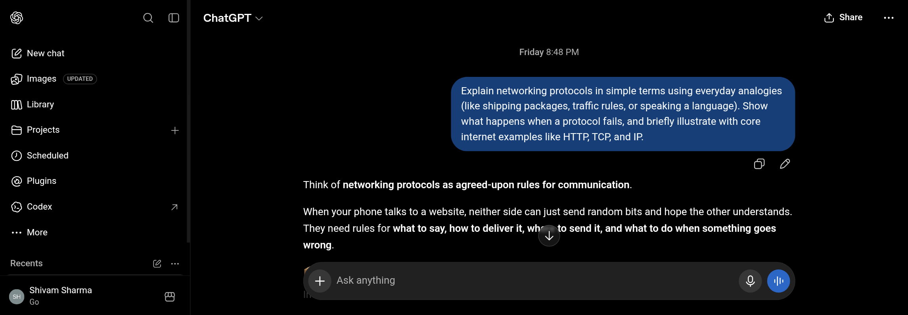
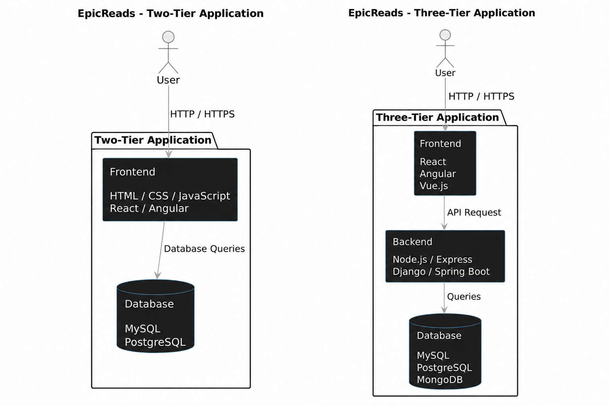
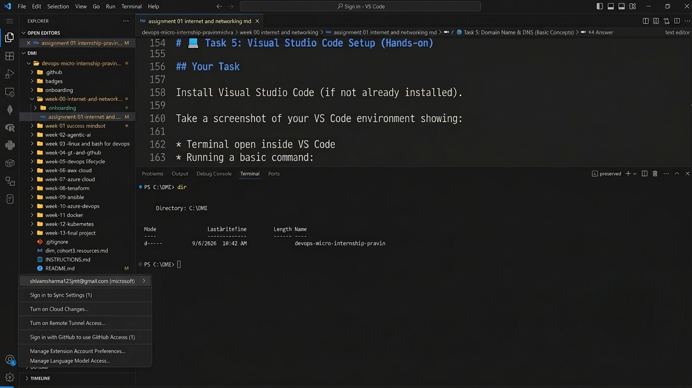

# Week 00 - Internet and Networking

Part of the DevOps Micro Internship (DMI) Cohort 3 with Agentic AI

---

# 🧑‍💻 Task 1: Using ChatGPT as Your Learning Assistant

## Scenario

You're new to DevOps and will frequently encounter technical questions. ChatGPT can be your learning companion.

## Your Task

Write a clear ChatGPT prompt to help you understand:

> "What is a protocol in networking? Explain with a simple real-life example."

Take a screenshot of your interaction showing:

* Your detailed prompt (with clear expectations)
* ChatGPT's simplified response with an example

## Screenshot

Save your screenshot in the `screenshots` folder and update the file name below.




Replace `task-1-chatgpt.png` with your actual screenshot file name.

---

## What I Learned (2–3 lines)

I learnt to use ChatGPT effectively by writing clear prompts based on which I got desirable results. I also gainded a foundational understanding on protocol and concepts related to it, including how it handles different jobs - IP handles addressing, TCP handles reliable delivery and HTTP handles web communication.

---

# 🌐 Task 2: Internet and Networking

## Scenario

Your friend is launching an online bookstore named **EpicReads**.

He asked you to explain how users globally can access his website hosted in Finland.

## Your Task

Write a short explanation (**100–150 words**) that includes:

* Packet Switching
* IP Address
* TCP/IP
* HTTP/HTTPS

💡 **Tip:** You may use ChatGPT (as demonstrated in Task 1) to refine your explanation.

## Answer

When a user anywhere in the world types www.epicreads.com in their browser, the request first goes through a process called DNS a.k.a. Domain Name System, which basically translates the domain name into an IP address so the internet knows where to find the server. The data then travels across different networks using packet switching, where the information is split into small packets that can take different routes and reach the destination even if some paths are congested or fail.

Each packet carries IP addresses so it knows where it's coming from and where it's going. On top of that, TCP i.e. Transmission Control Protocol makes sure all the packets arrive correctly and in the right order. The actual content you see on the website is fetched using HTTP/HTTPS, which not only handles the request and response between your browser and the server but also encrypts the data so it's secure.

So in simple terms, all these protocols work together behind the scenes to make sure your friend's website hosted in Finland is reachable, loads properly and stays secure no matter where the user is in the world.

---

# 🏗️ Task 3: Application Architecture & Stack

## Scenario

EpicReads bookstore has two application versions:

### Two-Tier Application

* Frontend
* Database

### Three-Tier Application

* Frontend
* Backend
* Database

## Your Task

* Draw simple diagrams (hand-drawn or tool-based such as draw.io)
* Label each layer clearly
* List at least two common technologies or tools used for each layer
* Submit a screenshot or photo clearly showing your own drawing

## Diagram Screenshot / Photo

Save your diagram image in the `screenshots` folder and update the file name below.




Replace `task-3-diagram.png` with your actual diagram file name.

---

## Technologies Used

### Frontend

* React
* Angular

### Backend

* Node.js
* Django

### Database

* MySQL
* PostgreSQL

---

# 🌍 Task 4: Domain Name & DNS (Basic Concepts)

## Scenario

Your friend's bookstore **EpicReads** is currently accessible through:

```text
52.172.142.222:3000
```

He purchased the domain:

```text
epicreads.com
```

## Your Task

In **50–100 words**, explain in your own words:

1. What is DNS (Domain Name System)?
2. Which DNS record type should be used to connect the domain to the given IP, and why?

## Answer

DNS i.e. Domain Name System is basically like a *phonebook of the internet.* Instead of remembering an IP address like 52.172.142.222, we can simply type epicreads.com and *DNS finds the IP address of the server for us.* 
In my friend's case, an *A record* should be used as it *connects a domain name to an IPv4 address.* So when someone enters epicreads.com, DNS looks up its A record and returns 52.172.142.222, allowing the browser to connect to the server.

---

# 💻 Task 5: Visual Studio Code Setup (Hands-on)

## Your Task

Install Visual Studio Code (if not already installed).

Take a screenshot of your VS Code environment showing:

* Terminal open inside VS Code
* Running a basic command:

### Windows

```powershell
dir
```

### Linux / macOS

```bash
pwd
ls
```

* Your selected VS Code theme clearly visible

⚠️ **Important:** The screenshot must show your username or another identifiable detail to confirm it is your environment.

## Screenshot

Save your screenshot in the `screenshots` folder and update the file name below.




Replace `task-5-vscode.png` with your actual screenshot file name.

---

# 🔗 Task 6: Publish Your Assignment as a LinkedIn Post

## Objective

Publishing on LinkedIn helps you:

* Build your professional online presence
* Reinforce your learning
* Document your DevOps journey publicly

## Your Task

Summarize your answers from Tasks 1–5 into a LinkedIn post.

Clearly structure your post into the following sections:

* ChatGPT
* Internet & Networking
* App Architecture
* DNS
* VS Code Setup

Use the credit note that matches your track:

Add the following credit note at the end of your post **(If you are DMI Cohort 3 student)**:

> **P.S. This post is part of the DevOps Micro Internship (DMI) with Agentic AI — Cohort 3 — by Pravin Mishra. My graded progress is public: https://dmi.pravinmishra.com/s/YOUR-GITHUB-USERNAME.html · Start your DevOps journey: https://dmi.pravinmishra.com/?utm_source=student&utm_medium=ps-linkedin&utm_campaign=cohort3**

**Tag [Pravin Mishra](https://www.linkedin.com/in/pravin-mishra-aws-trainer/) in your LinkedIn post, then tag Lead Co-Mentor — [Anjana Muthunayake](https://www.linkedin.com/in/anjana-muthunayake/).**

Add the following credit note at the end of your post **(If you are DMI Self-paced track student)**:

> **P.S. This post is part of the DevOps Micro Internship (DMI) — Self-Paced Engineer Track — by Pravin Mishra. My graded progress is public: https://dmi.pravinmishra.com/s/YOUR-GITHUB-USERNAME.html · Start your DevOps journey: https://dmi.pravinmishra.com/?utm_source=student&utm_medium=ps-linkedin&utm_campaign=self-paced**

Add the following credit note at the end of your post **(If you are DMI Campus student)**:

> **P.S. This post is part of the DevOps Micro Internship (DMI) — Campus — by Pravin Mishra. My graded progress is public: https://dmi.pravinmishra.com/s/YOUR-GITHUB-USERNAME.html · Start your DevOps journey: https://dmi.pravinmishra.com/?utm_source=student&utm_medium=ps-linkedin&utm_campaign=campus**

**Tag [Pravin Mishra](https://www.linkedin.com/in/pravin-mishra-aws-trainer/) in your LinkedIn post, then tag Lead Co-Mentor — [Anjana Muthunayake](https://www.linkedin.com/in/anjana-muthunayake/).**

Hashtags:

#DMIByPravinMishra #AgenticAI #DevOps

Replace `YOUR-GITHUB-USERNAME` with your GitHub username — that link is your public DMI progress page (your graded badge page).
---

## LinkedIn Post URL

Paste your LinkedIn post URL here:

```text
https://www.linkedin.com/posts/shivamsharma-builds_completed-assignment-1-of-the-devops-micro-activity-7504218848993169409-J_c4
```

---

## LinkedIn Post Backup Copy

Paste the full text of your LinkedIn post here:

Completed Assignment 1 of the DevOps Micro Internship (DMI) by Pravin Mishra and lead Co-mentor Anjana Muthunayake 🚀 

This module covered key fundamental concepts behind modern DevOps and cloud software systems:

1️⃣ ChatGPT as a Learning Assistant
Used targeted prompting to break down complex system concepts into clear mental models and real-world examples.

2️⃣ Internet & Networking Fundamentals
Covered data transmission basics:
Protocols & Packet Switching: How data is chunked, routed, and reassembled across networks.
TCP/IP & Protocols: Reliable transport mechanics, handshakes, and the security roles of HTTP/HTTPS.

3️⃣ App Architecture
2-Tier: Direct client-to-database connections (simple, but hard to scale and secure).
3-Tier: Adds an intermediate Backend/API layer for business logic, security, and independent database scaling.

4️⃣ DNS Essentials
How hierarchical name resolution maps domains to IP addresses.
The explicit role of A records for IPv4 routing and CNAMEs for aliasing.

5️⃣ VS Code Environment
Configured a workstation setup with git integration and CLI extensions ready for infrastructure and scripting tasks.
Excited to build on these core principles as we move into DevOps pipelines, cloud, containerization, and automation. 🚀

P.S. This post is part of the DevOps Micro Internship (DMI) — Self-Paced Engineer Track — by Pravin Mishra . 
My graded progress is public: https://lnkd.in/dMzjnr8Q · 
Start your DevOps journey: https://lnkd.in/deTzcpvf

---

# Reflection – Week 0

### What did you find easy?

I understood the fundamental concept of Internet and Networking, App architecture and stack as well as Domain and DNS.

---

### What was difficult?

Troubleshooting; due to my insufficient knowledge of AWS.

---

### What will you improve next week?

Dive deeper into using ChatGPT to its fullest and also tune my learning approach with the AI Tools.

---

## 📌 About DMI & CloudAdvisory

DevOps Micro Internship (DMI) is a project-based DevOps program run by Pravin Mishra (The CloudAdvisory) focused on real-world execution, systems thinking, and career readiness.

It helps learners build strong DevOps foundations with hands-on experience.


## 📌 Resources

- 🌐 **DMI Official Website:** https://dmi.pravinmishra.com?utm_source=github&utm_medium=readme  
- 🎓 **University:** https://university.pravinmishra.com?utm_source=github&utm_medium=readme  
- 💬 **Discord Community:** https://discord.pravinmishra.com?utm_source=github&utm_medium=readme  
- 📝 **Blog:** https://dmi.pravinmishra.com/blog?utm_source=github&utm_medium=readme  
- ▶️ **YouTube Playlist (DMI Cohort 3):** https://www.youtube.com/playlist?list=PLFeSNDtI4Cho  
- 🔗 **Pravin Mishra (LinkedIn):** https://www.linkedin.com/in/pravin-mishra-aws-trainer/  
- 🏢 **CloudAdvisory (LinkedIn):** https://www.linkedin.com/company/thecloudadvisory/

---

*This submission is part of DevOps Micro Internship (DMI) Cohort 3 — Agentic AI Track*
