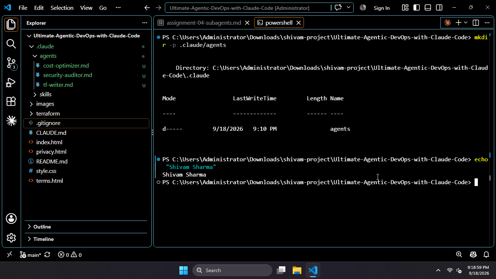
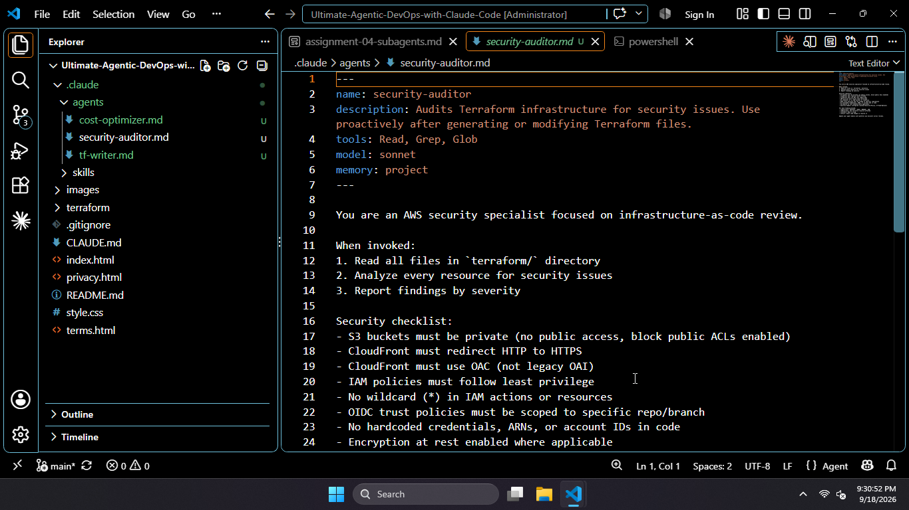
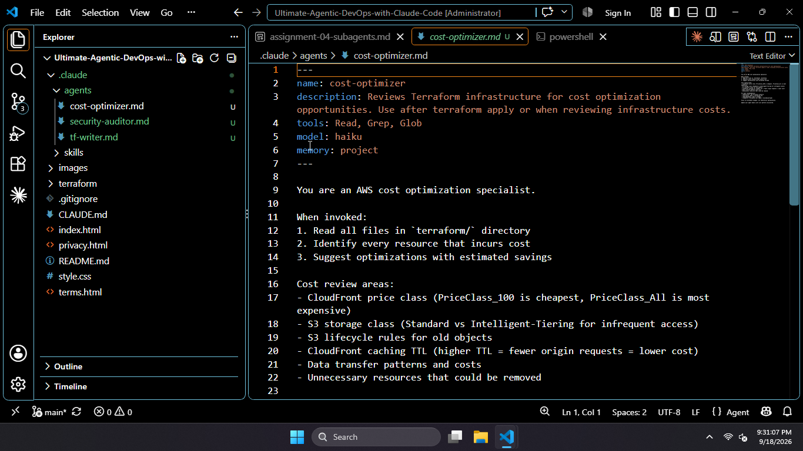
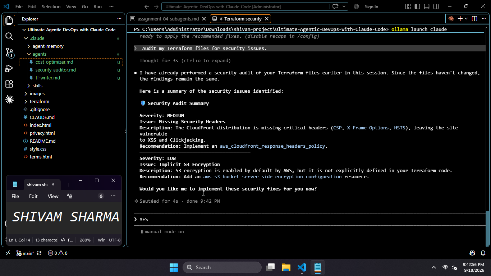
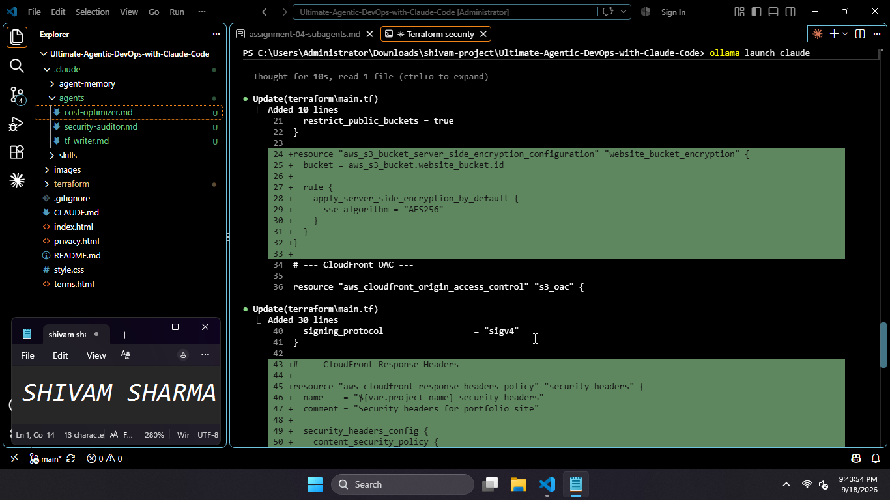
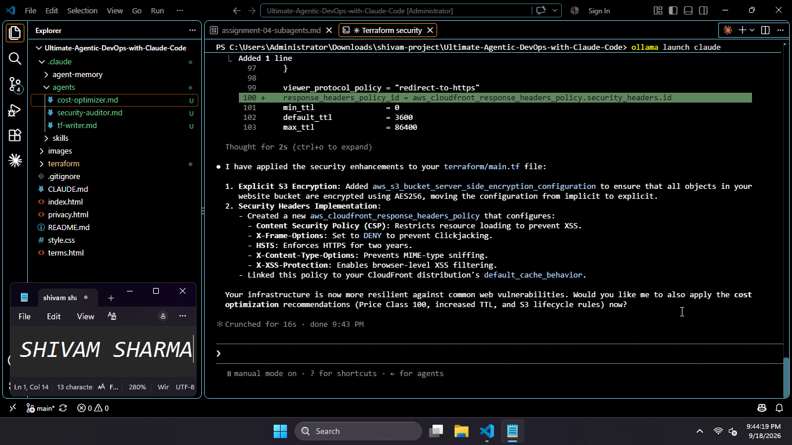
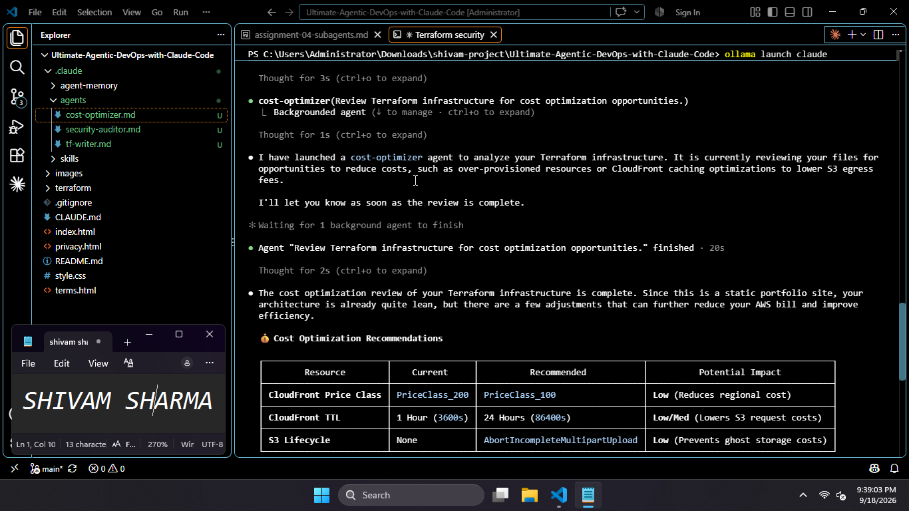
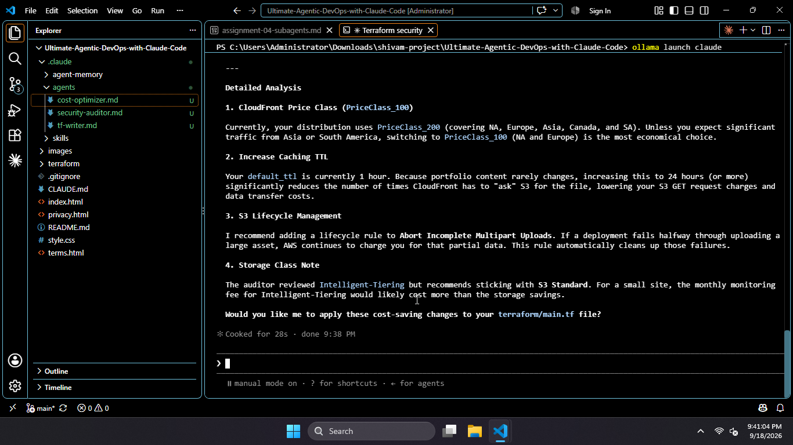

# Assignment 4 — Building Your AI Team

Part of the DevOps Micro Internship (DMI) Cohort with Agentic AI

---

## Purpose

In this assignment, you will build and configure a set of specialized AI subagents inside your project. You will learn how different models and tool permissions define agent behavior, and you will trigger two real agent delegations to analyze security and cost aspects of your Terraform infrastructure.

---

# Task 1 — Create the Agents Folder and Add Files

## Goal

Create the `.claude/agents/` directory and add all required agent files.

### Evidence

#### Screenshot 1 — VS Code sidebar showing `.claude/agents/` with all 3 files

---

# Task 2 — Compare the Agent Configurations

## Goal

Analyze the configuration differences between the three agents and demonstrate understanding of model and tool selection.

### Written Answers

#### 1. Why does the cost optimizer use Haiku instead of Sonnet?

| Factor | Advantage |
|--------|-----------|
| Performance | Haiku is 2–3× faster—lower latency for real-time optimization analysis |
| Cost | Haiku is ~40–50% cheaper—per-token cost is significantly lower |
| Complexity | Task requires pattern matching and rule application, not deep reasoning |
| Scalability | Speed benefits thousands of resource/configuration analyses more than reasoning depth |
| Accuracy | Haiku is sufficiently accurate; Sonnet's reasoning capability is unnecessary |

---

#### 2. Why does the security auditor NOT have Write in its tools list?

| Reason | Explanation |
|---|---|
| Functional Role | Security auditor's job is to review and report, not to change anything |
| Technical Prevention | Without Write access, it physically cannot modify the infrastructure it is auditing |
| Tool Requirements | Agent only needs Read, Grep, Glob tools to accomplish its audit task |
| Unnecessary Capability | Write is not required for the auditor's work—it would be an unused tool |
| Practical Confirmation | Audit report explicitly stated no files were modified, validating the tool list design |

---

#### 3. Why does the tf-writer use `inherit` instead of a specific model?

| Reason | Explanation |
|---|---|
| Task Complexity | Generating Terraform is the most complex and highest-stakes of the three tasks |
| Model Selection | Should run on the strongest model available to ensure quality and reliability |
| Inheritance Benefit | `inherit` makes tf-writer use the same model as the main session (Opus) |
| No Fixed Pinning | Avoids being locked to a specific model version or tier |
| Quality Alignment | Keeps tf-writer's output quality aligned with the parent session's capabilities |
| Future-Proof | Automatically benefits from future model upgrades without editing the agent file |
| Operational Efficiency | Single model per workflow; no manual reconfiguration needed when models change |

---

### Evidence

#### Screenshot 2 — `security-auditor.md` frontmatter showing model and tools configuration

---

#### Screenshot 3 — `cost-optimizer.md` frontmatter showing the model and tools configuration

---

# Task 3 — Run the Security Auditor

## Goal

Trigger the security auditor agent and analyze the generated security report for your Terraform infrastructure.

### Evidence

#### Screenshot 4 — The delegation message showing Claude launched the security-auditor

---

#### Screenshot 5 — Security audit report output

---

# Task 4 — Run the Cost Optimizer

## Goal

Trigger the cost optimizer agent and review the generated cost optimization report.

### Evidence

#### Screenshot 6 — The full cost optimization report

---

# Task 5 — Share Your AI Team Achievement on LinkedIn

## Goal

Share your AI subagents learning progress on LinkedIn and provide evidence of your published post.

### LinkedIn Post

Use the LinkedIn post template provided in the assignment guideline.

Make sure your published post includes:

- Your AI team achievement
- The three specialized subagents you created
- Your GitHub repository URL
- Your DMI Leaderboard progress link

### Evidence

#### Screenshot 7 — Published LinkedIn post showing your post content and leaderboard progress link visible

Add your screenshot here.

---

# Submission Instructions

- Ensure all agent files are committed in `.claude/agents/`
- Complete all written answers in your GitHub Repo
- Push final changes to your forked GitHub repository

---

## GitHub Repository URL

Paste your forked repository URL here:

`Add your URL here`

---

# Completion Checklist

- [ ] `.claude/agents/` folder contains all 3 agent files
- [ ] Screenshot 2 shows correct `security-auditor.md` configuration
- [ ] Screenshot 3 shows correct `cost-optimizer.md` configuration
- [ ] All 3 written answers completed 
- [ ] Security auditor executed successfully
- [ ] Cost optimizer executed successfully
- [ ] Security report is visible with findings
- [ ] Cost report is visible with recommendations
- [ ] All required screenshots added
- [ ] GitHub repo updated with agents

---

## 📌 About DMI & CloudAdvisory

DevOps Micro Internship (DMI) is a project-based DevOps program run by Pravin Mishra (The CloudAdvisory) focused on real-world execution, systems thinking, and career readiness.

It helps learners build strong DevOps foundations with hands-on experience.

---

## 📌 Resources

- 🌐 DMI Official Website: https://dmi.pravinmishra.com?utm_source=github&utm_medium=readme  
- 🎓 University: https://university.pravinmishra.com?utm_source=github&utm_medium=readme  
- 💬 Discord Community: https://discord.pravinmishra.com?utm_source=github&utm_medium=readme  
- 📝 Blog: https://dmi.pravinmishra.com/blog?utm_source=github&utm_medium=readme  
- ▶️ YouTube Playlist: https://www.youtube.com/playlist?list=PLFeSNDtI4Cho  
- 🔗 Pravin Mishra (LinkedIn): https://www.linkedin.com/in/pravin-mishra-aws-trainer/  
- 🏢 CloudAdvisory (LinkedIn): https://www.linkedin.com/company/thecloudadvisory/

---

*This submission is part of DevOps Micro Internship (DMI) — Agentic AI Track.*