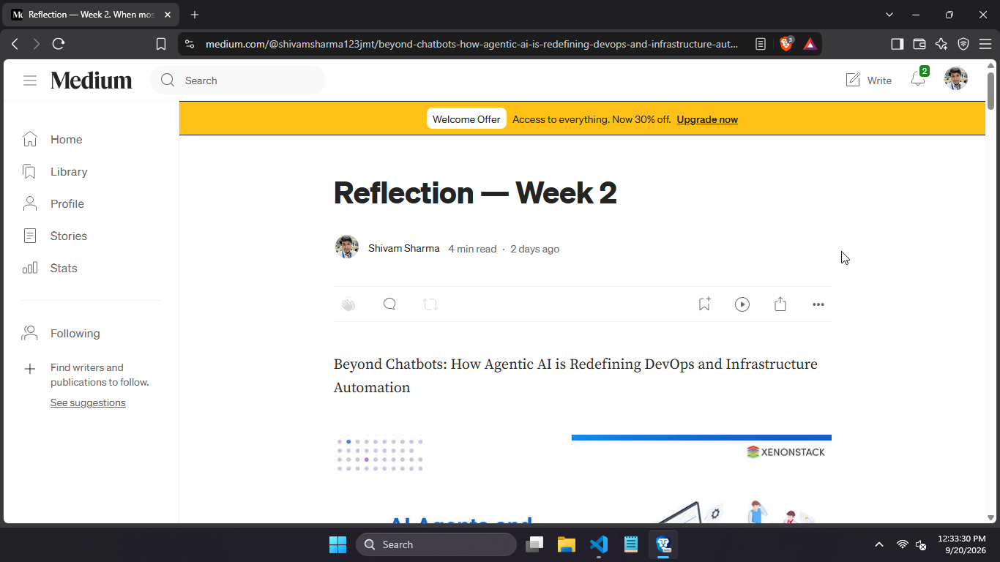
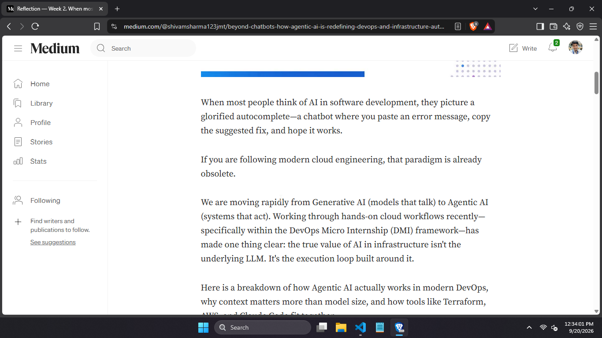
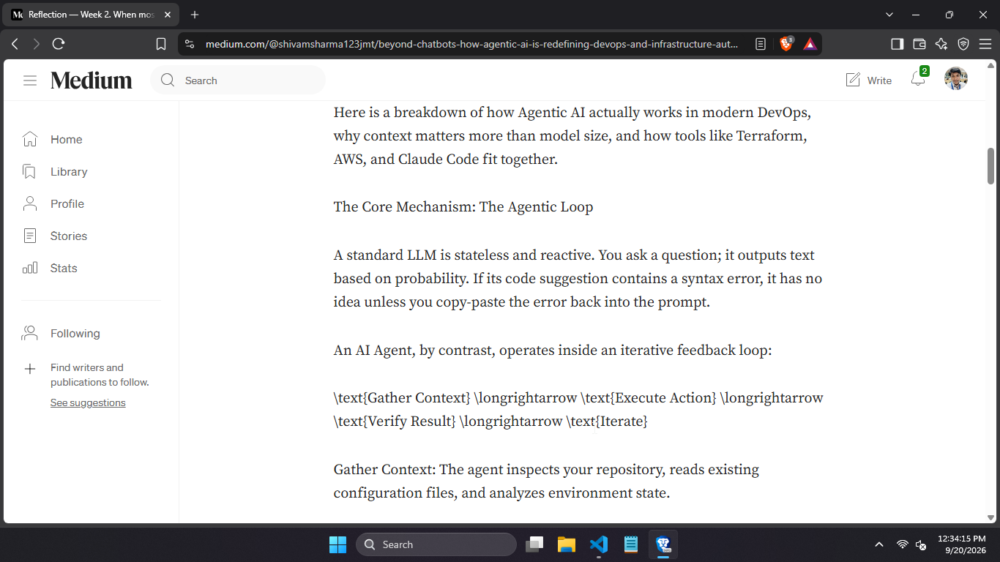
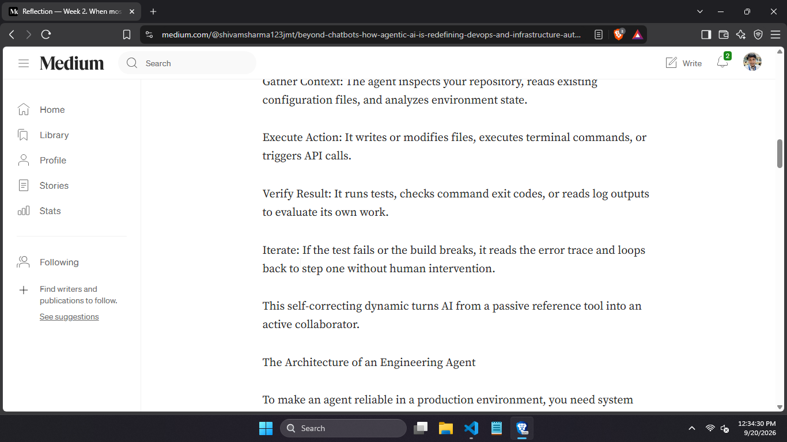
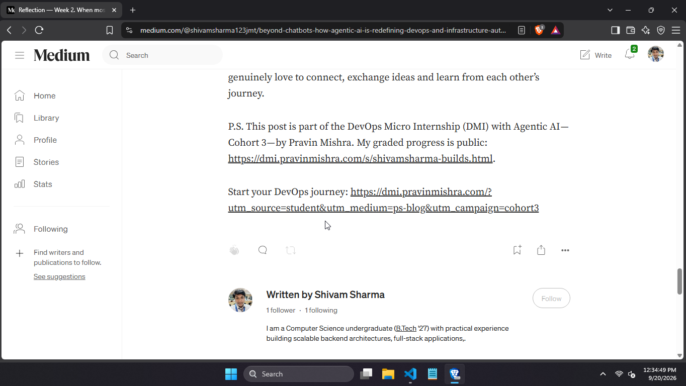
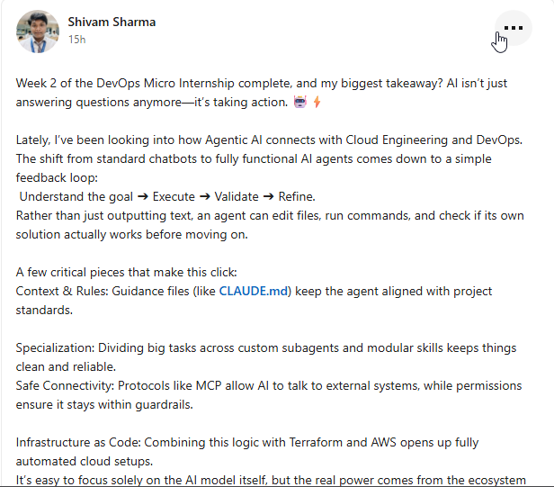
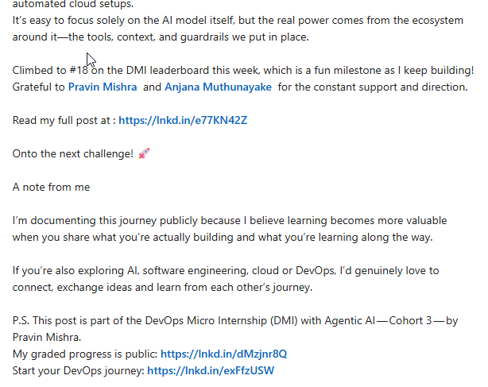
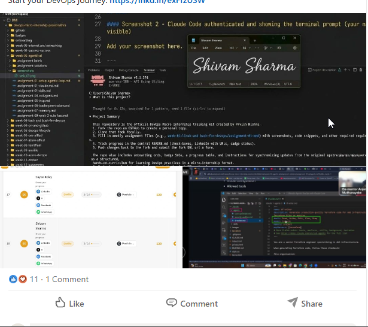

# Assignment 8 — Week 2 Reflection Blog

Part of the DevOps Micro Internship (DMI) with Agentic AI

---

# Purpose

In this assignment, you will reflect on your Week 2 learning journey and write a short blog capturing your experience working with Agentic AI tools such as Claude Code, Skills, Subagents, MCP, Hooks, Permissions, and Memory.

You will also publish a LinkedIn post summarizing your learning and share both links for evaluation.

---

# Task 1 — Write Your Reflection Blog

## Goal

Write a reflection blog covering your Week 2 learning experience.

### Blog Requirements

Your blog must include:

* Title: **Reflection – Week 2**
* Minimum 300 words
* At least 2–3 topics from Week 2 (Claude Code, Skills, Subagents, MCP, Hooks, Permissions, Memory)
* Honest personal reflection (learning, challenges, mindset)
* One habit/system you plan to implement
* Your full name clearly visible

### Allowed Platforms

You can publish your blog on:

* Hashnode
* Medium
* Dev.to
* LinkedIn Article
* GitHub Markdown file
* Substack

---

### Evidence

#### Screenshot 1 — Blog published and visible







---

### Submission Field

Blog Link:

`https://medium.com/@shivamsharma123jmt/beyond-chatbots-how-agentic-ai-is-redefining-devops-and-infrastructure-automation-e5bf3e32deae`

---

# Task 2 — Create LinkedIn Post

## Goal

Share your Week 2 learning publicly on LinkedIn.

---

### Evidence

#### Screenshot 2 — LinkedIn post published





---

### Submission Field

LinkedIn Post Content (copy-paste here):

```
Week 2 of the DevOps Micro Internship complete, and my biggest takeaway? AI isn’t just answering questions anymore—it’s taking action. 🤖⚡

Lately, I’ve been looking into how Agentic AI connects with Cloud Engineering and DevOps. The shift from standard chatbots to fully functional AI agents comes down to a simple feedback loop:
 Understand the goal ➔ Execute ➔ Validate ➔ Refine.
Rather than just outputting text, an agent can edit files, run commands, and check if its own solution actually works before moving on.

A few critical pieces that make this click:
Context & Rules: Guidance files (like CLAUDE.md) keep the agent aligned with project standards.

Specialization: Dividing big tasks across custom subagents and modular skills keeps things clean and reliable.
Safe Connectivity: Protocols like MCP allow AI to talk to external systems, while permissions ensure it stays within guardrails.

Infrastructure as Code: Combining this logic with Terraform and AWS opens up fully automated cloud setups.
It’s easy to focus solely on the AI model itself, but the real power comes from the ecosystem around it—the tools, context, and guardrails we put in place.

Climbed to #18 on the DMI leaderboard this week, which is a fun milestone as I keep building! 
Grateful to Pravin Mishra and Anjana Muthunayake for the constant support and direction.

Read my full post at : https://lnkd.in/e77KN42Z

Onto the next challenge! 🚀

A note from me

I’m documenting this journey publicly because I believe learning becomes more valuable when you share what you’re actually building and what you’re learning along the way.

If you’re also exploring AI, software engineering, cloud or DevOps, I’d genuinely love to connect, exchange ideas and learn from each other’s journey.

P.S. This post is part of the DevOps Micro Internship (DMI) with Agentic AI — Cohort 3 — by Pravin Mishra. 
My graded progress is public: https://lnkd.in/dMzjnr8Q
Start your DevOps journey: https://lnkd.in/exFfzUSW
```

---

### LinkedIn Post Link:

`https://www.linkedin.com/posts/shivamsharma-builds_week-2-of-the-devops-micro-internship-complete-ugcPost-7506369633835339777-j__t`

---

# Submission Instructions

* Blog must be publicly accessible
* LinkedIn post must be visible (public or unlisted where applicable)
* All required fields must be filled
* Screenshot proofs must be added to GitHub repository
* Do not include sensitive information in blog or post

---

# Completion Checklist

* [✅] Blog written with required structure
* [✅] Blog includes at least 2–3 Week 2 topics
* [✅] Blog is publicly accessible
* [✅] LinkedIn post created
* [✅] Required P.S. line included
* [✅] LinkedIn post content copied in submission field
* [✅] Blog link added
* [✅] LinkedIn post link added
* [✅] Screenshots added to GitHub repo

---

# About DMI & CloudAdvisory

DevOps Micro Internship (DMI) is a project-based DevOps program run by Pravin Mishra (The CloudAdvisory), focused on real-world execution, systems thinking, and agentic AI workflows.

It helps learners build strong DevOps foundations through hands-on experience.

---

# Resources

* 🌐 DMI Official Website: [https://dmi.pravinmishra.com?utm_source=github&utm_medium=readme](https://dmi.pravinmishra.com?utm_source=github&utm_medium=readme)
* 🎓 University: [https://university.pravinmishra.com?utm_source=github&utm_medium=readme](https://university.pravinmishra.com?utm_source=github&utm_medium=readme)
* 💬 Discord Community: [https://discord.pravinmishra.com?utm_source=github&utm_medium=readme](https://discord.pravinmishra.com?utm_source=github&utm_medium=readme)
* 📝 Blog: [https://dmi.pravinmishra.com/blog?utm_source=github&utm_medium=readme](https://dmi.pravinmishra.com/blog?utm_source=github&utm_medium=readme)
* ▶️ YouTube Playlist: [https://www.youtube.com/playlist?list=PLFeSNDtI4Cho](https://www.youtube.com/playlist?list=PLFeSNDtI4Cho)
* 🔗 Pravin Mishra (LinkedIn): [https://www.linkedin.com/in/pravin-mishra-aws-trainer/](https://www.linkedin.com/in/pravin-mishra-aws-trainer/)
* 🏢 CloudAdvisory (LinkedIn): [https://www.linkedin.com/company/thecloudadvisory/](https://www.linkedin.com/company/thecloudadvisory/)
---

*This submission is part of DevOps Micro Internship (DMI) — Agentic AI Track.*
