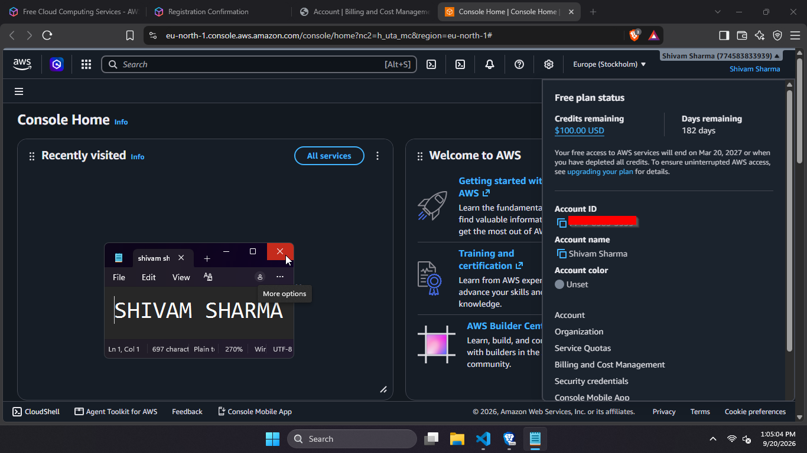
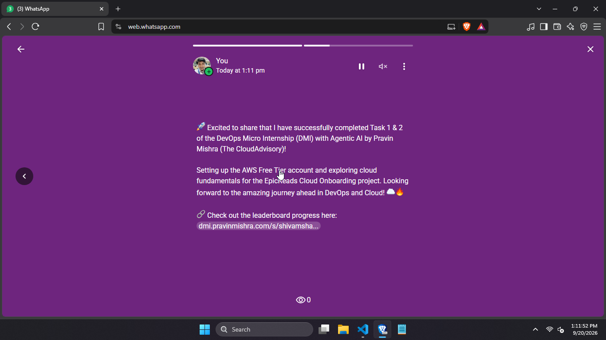

# Assignment 1 — AWS Free Tier Account Setup (EpicReads Cloud Onboarding)

Part of the DevOps Micro Internship (DMI) with Agentic AI

---

## Purpose

In this assignment, you will create and verify an AWS Free Tier account as part of onboarding EpicReads — an online bookstore moving to the cloud. You will demonstrate an understanding of AWS fundamentals, Free Tier services, and account setup by answering conceptual questions and capturing proof of a working AWS Console login.

---

# Task 1 — Understanding AWS & Free Tier

## Goal

Demonstrate understanding of AWS basics and Free Tier usage by answering the following questions in your own words (3–4 lines each).

### Answers

#### Question 1 — What is an AWS account, and why do you need it at this stage?

An AWS account is your unique identity within AWS that lets you provision and manage cloud resources. You need it to experiment hands-on with services like EC2, S3, and SageMaker for your infrastructure projects and certification work.

---

#### Question 2 — What is AWS Free Tier, and how long does it last?

AWS Free Tier gives new customers free access to many services for 6 months. Some services (like S3 and CloudTrail) offer perpetual free tiers with usage caps even after 6 months.

---

#### Question 3 — Name three AWS Free Tier services and their free usage limits.

- **EC2**: 750 hours per month of Linux, RHEL, or SLES t2.micro instance usage (or Windows t2.micro)
- **S3**: 5 GB of standard storage, 20,000 GET requests, 2,000 PUT requests
- **Lambda**: Free tier with always free offer and specified monthly usage limits

---

# Task 2 — Create AWS Free Tier Account

## Goal

Create a valid AWS Free Tier account and sign in to the AWS Management Console.

> No screenshots required for this task. Completion is verified through Task 3.

---

# Task 3 — Verify AWS Account

## Goal

Confirm that your AWS account setup is complete by navigating to the Account section and capturing proof.

### Evidence

#### Screenshot 1 — AWS Account page showing account name (email may be blurred)

---

# Task 4 — Share Your AWS Cloud Onboarding Progress

## Goal

Share your AWS cloud onboarding progress on WhatsApp Status and provide evidence of the published status.

### Evidence

### Screenshot 2 — Published WhatsApp Status showing your AWS onboarding message and leaderboard progress link visible

---

# Submission Instructions

- Add all required screenshots in your GitHub repository submission
- Full name must be visible in required screenshots
- Do not expose sensitive information (keys, passwords, account IDs)
- Share your AWS onboarding progress on WhatsApp Status (Task 4)

---

# Completion Checklist

- [✅] Task 1 answers written in own words
- [✅] AWS Free Tier account created successfully
- [✅] Signed in to AWS Management Console
- [✅] Screenshot 1 of AWS Account page captured (full name visible, no sensitive data)
- [✅] Task 4: AWS onboarding progress shared on WhatsApp Status
- [✅] Screenshot 2 of published WhatsApp Status captured with leaderboard progress link visible
- [✅] All required screenshots added to repository

---

## 📌 About DMI & CloudAdvisory

DevOps Micro Internship (DMI) is a project-based DevOps program run by Pravin Mishra (The CloudAdvisory) focused on real-world execution, systems thinking, and career readiness.

It helps learners build strong DevOps foundations with hands-on experience.

---

## 📌 Resources

- 🌐 DMI Official Website: https://dmi.pravinmishra.com?utm_source=github&utm_medium=readme  
- 🎓 University: https://university.pravinmishra.com?utm_source=github&utm_medium=readme  
- 💬 Discord Community: https://discord.pravinmishra.com?utm_source=github&utm_medium=readme  
- 📝 Blog: https://dmi.pravinmishra.com/blog?utm_source=github&utm_medium=readme  
- ▶️ YouTube Playlist: https://www.youtube.com/playlist?list=PLFeSNDtI4Cho  
- 🔗 Pravin Mishra (LinkedIn): https://www.linkedin.com/in/pravin-mishra-aws-trainer/  
- 🏢 CloudAdvisory (LinkedIn): https://www.linkedin.com/company/thecloudadvisory/

---

*This submission is part of DevOps Micro Internship (DMI) — Agentic AI Track.*