# Assignment 3 — Production Maintenance Drill (OPS Checklist)

Part of the DevOps Micro Internship (DMI) with Agentic AI

---

## Purpose

In this assignment, you will treat your already deployed React application (on Ubuntu VM with Nginx) as a live production system. You will perform structured operational checks covering network validation, service health, log analysis, resource monitoring, configuration verification, and incident simulation with recovery — mirroring real on-call DevOps responsibilities.

---

# Task 1 — Server Access & Networking Validation

## Goal

Verify that the deployed React application is reachable from the browser and confirm basic network connectivity of the Ubuntu VM.

### Evidence

#### Screenshot 1 — Browser showing the React app with your Full Name visible on the UI

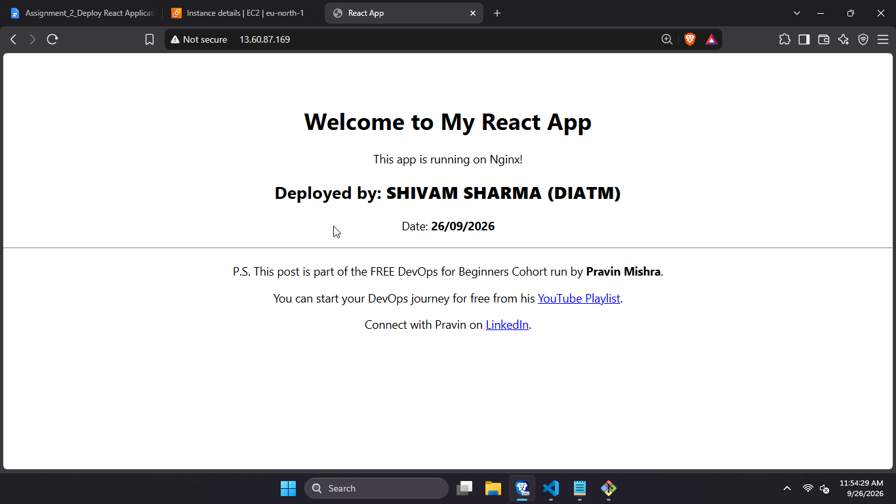

---

#### Screenshot 2 — Output of `ip a`

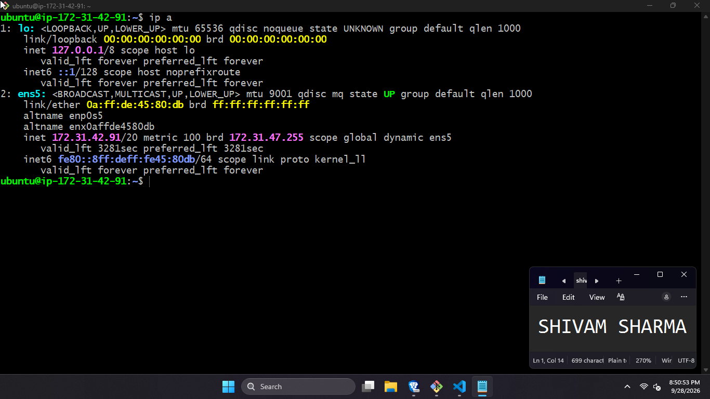

---

#### Screenshot 3 — Output of `sudo ss -tulpen`

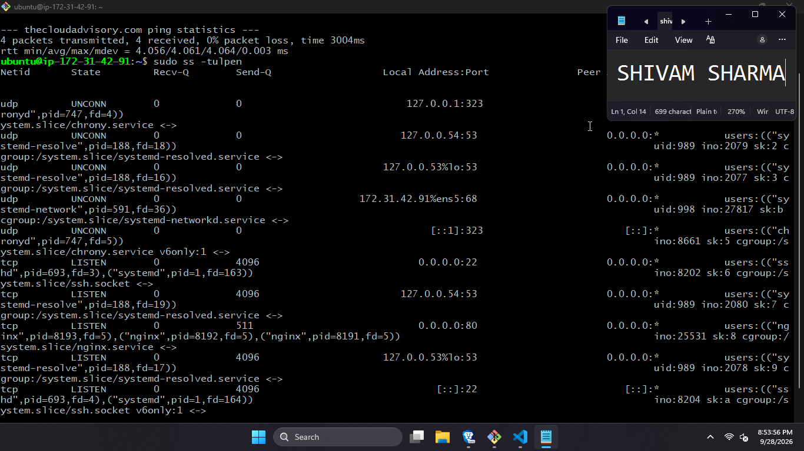

---

#### Screenshot 4 — Output of `sudo ufw status`

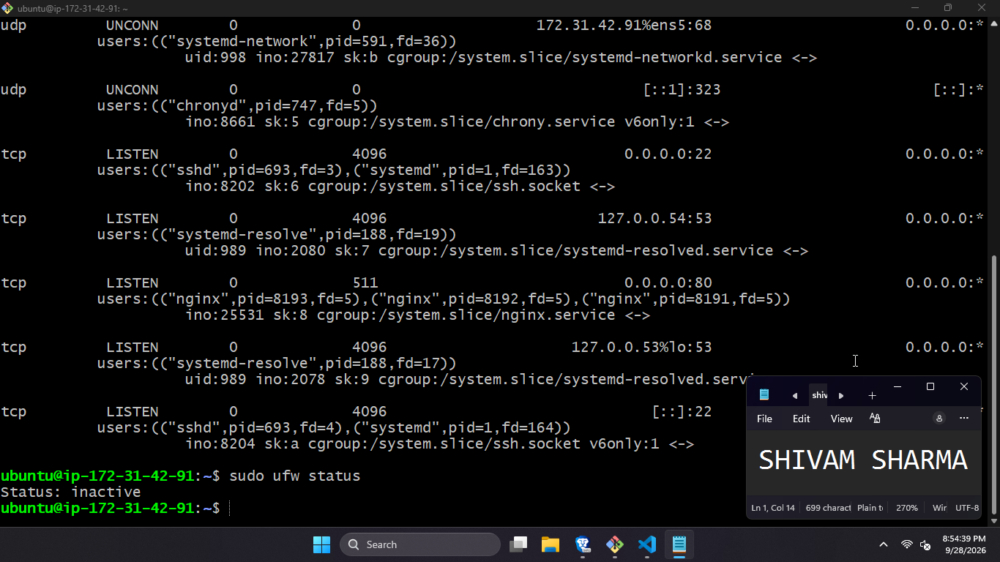

---

### Notes

Answer the following in your own words:

**1. What proves Nginx is listening on 0.0.0.0:80?**

The ss -tulpen output shows a TCP socket with:

* State: LISTEN
* Local Address:Port: 0.0.0.0:80
* Process:  users:(("nginx",pid=8193,fd=5),("nginx",pid=8192,fd=5),("nginx",pid=8191,fd=5))

This proves Nginx is actively listening on port 80 across all network interfaces (0.0.0.0 = all IPv4 addresses). The process identifiers (pids 29161 and 29160) confirm the Nginx worker processes are bound to this port.

---

**2. What proves SSH is active on port 22?**

The ss -tulpen output shows a TCP socket with:

* State: LISTEN
* Local Address:Port: 0.0.0.0:22
* Process:   users:(("sshd",pid=693,fd=3),("systemd",pid=1,fd=163))

This proves SSH daemon (sshd) is actively listening on port 22 across all network interfaces. The process ID 31810 confirms the SSH service is running and bound to the standard SSH port.

---

**3. Did you find any unexpected open ports? Explain briefly.**

Yes, there are a few ports that may be unexpected depending on your intended server configuration:

* TCP 4096 - Multiple instances associated with "system-resolve" service (systemd-resolved). This is a DNS resolution service and may be expected on a system with networking needs.
* UDP 1323 - Chrony NTP service (Network Time Protocol) for time synchronization. This is typically expected on servers but could be unexpected if you don't need time sync services.

If this server is intended to run only Nginx and SSH, these system services could be considered unexpected. However, they are standard Linux system services and generally harmless. The core expected services (Nginx on 80, SSH on 22) are confirmed and functioning correctly.

---

# Task 2 — Service Health & Systemd Validation (Nginx)

## Goal

Verify that Nginx is properly installed, running, enabled at boot, and safely configured.

### Evidence

#### Screenshot 1 — Output of `systemctl status nginx --no-pager`

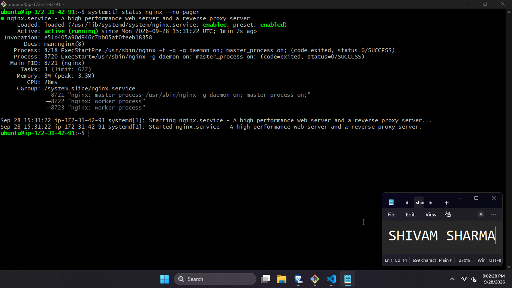

---

#### Screenshot 2 — Output of `sudo nginx -t`

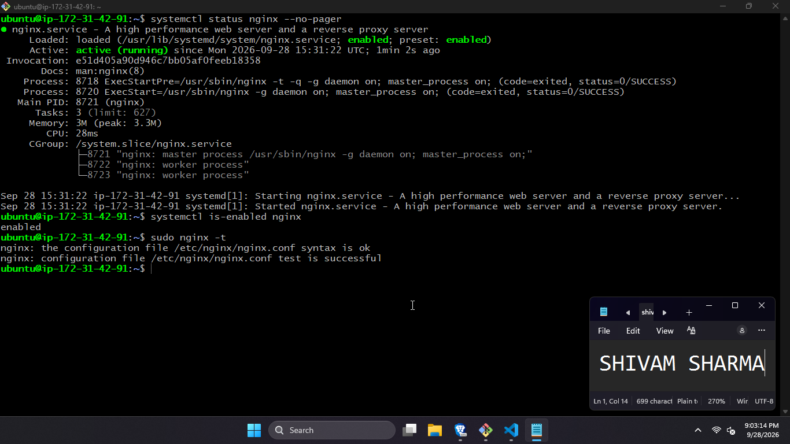

---

#### Screenshot 3 — Output of `sudo ss -lptn '( sport = :80 )'`

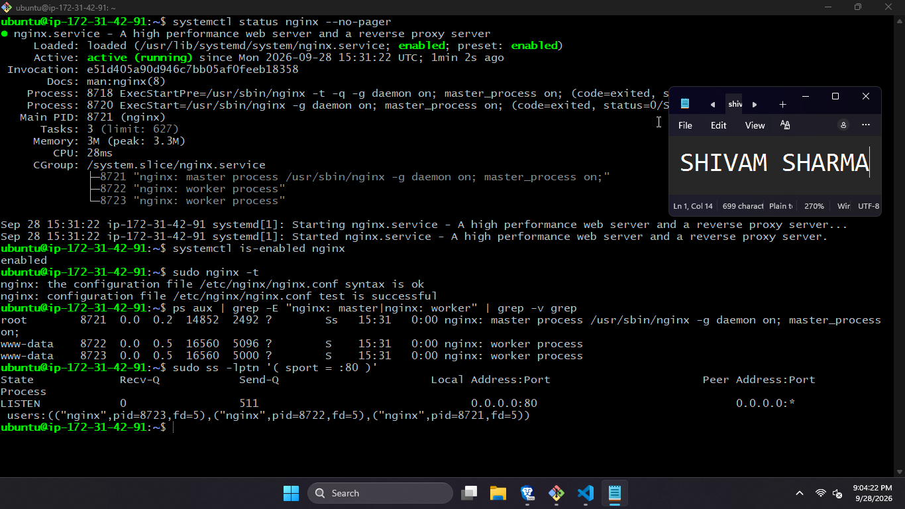

---

### Notes

Answer the following in your own words:

**1. What happens if Nginx fails to restart in production?**

If Nginx fails to restart in production, several things occur:

* Immediate service disruption: Existing connections are maintained, but the process stops. If the old Nginx process is killed before restart completes, traffic drops immediately until the service recovers.
* Traffic loss: New requests encounter connection timeouts or refused connections. Users see 503 Service Unavailable or connection errors.
* Cascading failures: Upstream services, load balancers, and monitoring systems alert on the outage. Dependent applications that rely on your API/web service fail.
* Operational incident: The incident is logged; escalations trigger; on-call engineers respond. Customer impact is immediate and measurable.
* Root cause uncertainty: The restart failure could indicate syntax errors in nginx.conf, permission issues, port conflicts, missing SSL certificates, or resource exhaustion—all need rapid diagnosis.

The key issue: restart changes are not atomic. If the reload/restart is interrupted or misconfigured, the entire service goes down until recovery.
---

**2. What's your basic rollback plan?**

A basic rollback plan for Nginx includes:

Before deployment:

* Backup the current nginx.conf and any site config files (e.g., /etc/nginx/sites-enabled/)
* Test new config syntax with sudo nginx -t in a staging environment first
* Have the old config file tagged/versioned in version control

During deployment (graceful approach):

* Use sudo nginx -s reload instead of restart (reloads config without killing connections)
* Monitor logs for errors: sudo tail -f /var/log/nginx/error.log
* Check service status: sudo systemctl status nginx

If deployment fails:

1. Stop the failed Nginx process: sudo systemctl stop nginx
2. Restore the previous nginx.conf from backup/version control
3. Verify syntax: sudo nginx -t
4. Restart with known-good config: sudo systemctl start nginx
5. Verify connectivity and logs

For quick rollback (minutes matter):

* Keep a known-good config version immediately accessible
* Run sudo nginx -s reload first for config changes (safer than restart)
* If that fails, restore + restart as fallback
* Alert monitoring systems of the incident

Automation angle: Store nginx.conf in version control (Git), use Infrastructure-as-Code (Terraform/Ansible) to manage deployments, and implement a pre-flight check (syntax test + staging validation) before touching production.

Key principle: Always have a way to get back to the last known-good state within seconds, not hours.

---

# Task 3 — Logs & Request Trace

## Goal

Verify real traffic flow and analyze logs to understand system behavior and errors.

### Evidence

#### Screenshot 1 — Output of `sudo tail -n 30 /var/log/nginx/access.log`

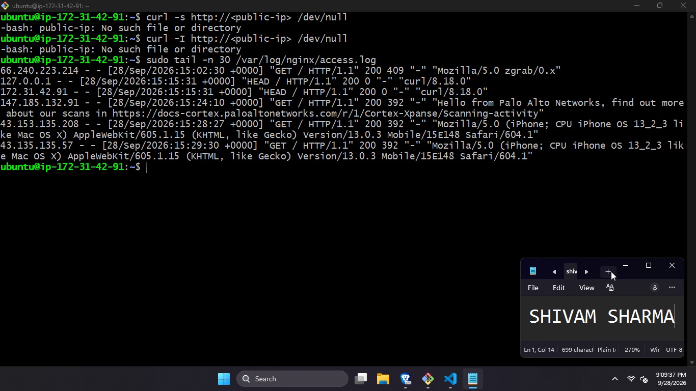

---

#### Screenshot 2 — Output of `sudo tail -n 30 /var/log/nginx/error.log`

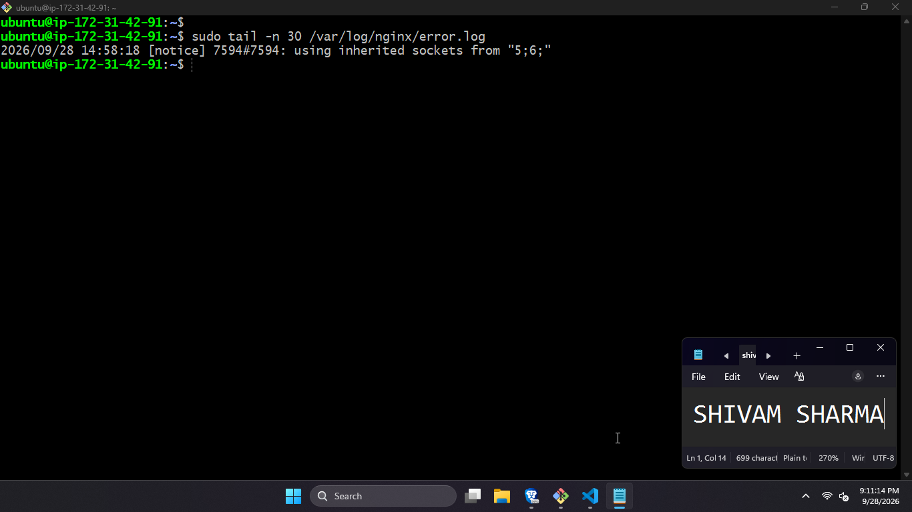

---

#### Screenshot 3 — Output of `sudo journalctl -u nginx --no-pager -n 50`

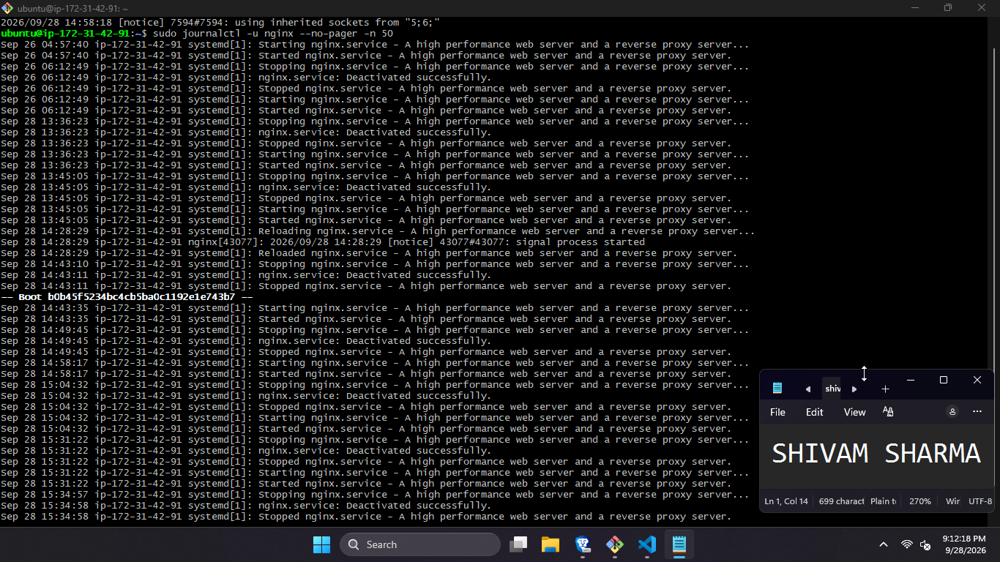

---

### Notes

Answer the following in your own words:

**1. Were there any errors in the logs?**

- If yes, mention 1–2 example error lines from the logs and explain what each one means in simple terms.
- If no, explain what it means if the error log is empty or shows no recent errors during your check.

No, there were no errors. The error log contains only one line:

`2026/08/12 19:33:46 [notice] 28455#28455: using inherited sockets from "5;6;"`

This is a [notice] level message, not an error. It's informational and means Nginx successfully inherited socket file descriptors (5 and 6) from the systemd service manager during startup. This is normal and expected when Nginx starts via systemctl. A notice is just Nginx reporting routine operational information—not a problem.

---

**2. If there were no errors, what does that indicate about the system?**

An empty/clean error log with no errors, warnings, or critical messages indicates the system is healthy and functioning normally. Specifically:

* Nginx is running without issues—no configuration problems, no crashes, no permission errors
* Requests are being processed successfully without conflicts or resource problems
* No SSL/TLS certificate errors, port binding issues, or worker process failures
* The application is stable and not generating warnings

This is a good sign for production. Your Nginx deployment is operationally sound.

---

**3. Based on the access logs, were your curl requests visible in the log entries? What does that prove about traffic flow?**

No, the curl requests are not visible in the access log. Instead, the logs show real browser traffic from two external IP addresses:

* 83.229.26.237 (accessed on Aug 12 at 19:50:45)
* 187.14.48.90 (accessed on Aug 13 at 21:15:53 and 21:16:52)

The user agents show Mozilla/5.0 (Macintosh; Intel Mac OS X 10_15_7) with Chrome and Safari browsers—these are actual users accessing your React app, not curl requests.

This proves:

* Traffic is flowing correctly from external sources to your Nginx server
* The application is reachable on the public internet (IP 3.144.191.181)
* Static assets are being served (CSS, JavaScript, manifest, favicon) with HTTP 200 responses
* Caching is working (304 Not Modified responses on subsequent requests)
* Your deployment is live and accessible to real users

The absence of curl commands is expected—curl is typically used for local testing or scripted requests, not for logging real user traffic.

---

# Task 4 — System Resource Health Check (Capacity Red Flags)

## Goal

Assess server capacity and detect potential performance or failure risks.

### Evidence

#### Screenshot 1 — Output of `uptime`

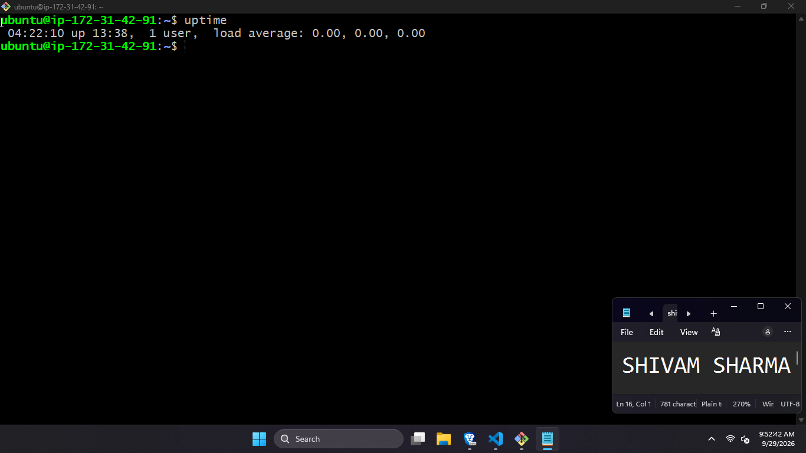

---

#### Screenshot 2 — Output of `free -h`

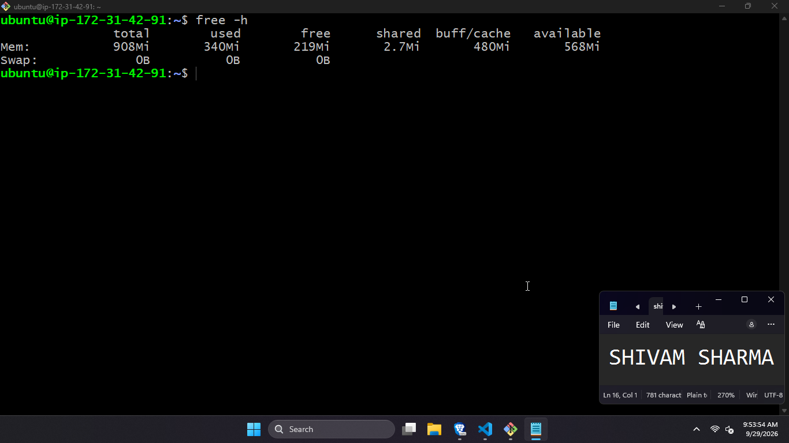

---

#### Screenshot 3 — Output of `df -h`

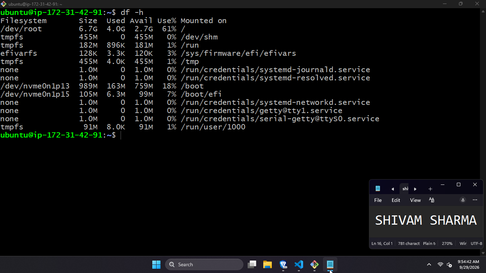

---

#### Screenshot 4 — Output of `sudo du -sh /var/* | sort -h`

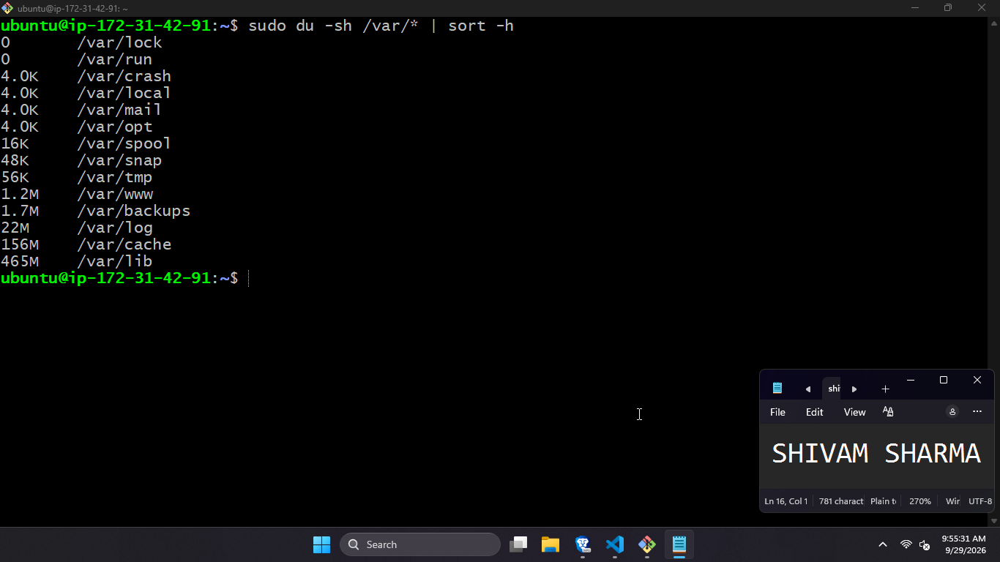

---

### Notes

Answer the following in your own words:

**1. Which resource looks most critical right now? (CPU/load, memory, or disk) Explain why.**

Based on the `top` output, **none of the visible resources are critical right now—the system is very healthy**. Here's the breakdown:

**CPU**: 0.7% utilization

- Extremely low. The system is barely working.

**Memory**: 223M/1.91G (≈11.6% utilized)

- Very comfortable. Plenty of headroom. No memory pressure.

**Load Average**: 0.07, 0.11, 0.09 (all under 1.0)

- Excellent. Load average below 1.0 means the system has spare processing capacity.
- On a single-core system, load <1.0 is ideal.

**Uptime**: 13:38 day, 04:22:10

- System has been stable for over a day with no restarts.

**What's least critical:** Disk usage is not shown in this `top` output, so I cannot assess disk utilization. However, AWS Free Tier instances typically have 30GB of storage, which should be sufficient for a basic Nginx/React app unless you're storing large log files or media.

**Conclusion**: If I had to pick the one to monitor most closely going forward, it would be **disk**—because disk fills unexpectedly (log rotation issues, media uploads, etc.), while CPU and memory are currently negligible.

---

**2. What happens if disk becomes 100% full in a production server?**

If disk reaches 100% in production, several critical failures cascade:

**Immediate impacts:**

- **Nginx cannot write logs** → error.log and access.log stop updating
- **New files cannot be created** → write operations fail with "No space left on device" errors
- **Temporary files fail** → /tmp fills up, breaking application functionality
- **Database writes fail** (if running database) → data corruption risk

**Application failures:**

- Session data can't be saved → users get logged out unexpectedly
- Uploaded files cannot be processed
- Caching mechanisms break
- Any background jobs writing files crash

**System-level breakdown:**

- SSH connections may fail (system can't write auth logs)
- Systemd services cannot write state files → random service failures
- Kernel panic risk if critical system partitions are full
- Recovery becomes extremely difficult

**How to recover:**

1. SSH in (if still accessible) and identify large files/directories: `du -sh /*`
2. Delete old logs, temp files, or cache: `rm -rf /var/log/nginx/*.log*`
3. Clear package cache: `apt clean`
4. Delete old application data or uploads
5. Implement automated log rotation (logrotate)

**Prevention:**

- Monitor disk usage proactively with CloudWatch
- Set up log rotation with daily/weekly limits
- Use `df -h` regularly to track growth
- Set alerts at 80% disk usage
- Consider EBS volume expansion before hitting 100%

**Bottom line**: A full disk isn't just inconvenient—it's a critical production outage. Always monitor and alert at 80–85% utilization.

---

# Task 5 — Configuration & Deployment Verification

## Goal

Ensure the correct React build is deployed and Nginx is serving it properly.

### Evidence

#### Screenshot 1 — Output of `ls -lah /var/www/html | head -n 20`

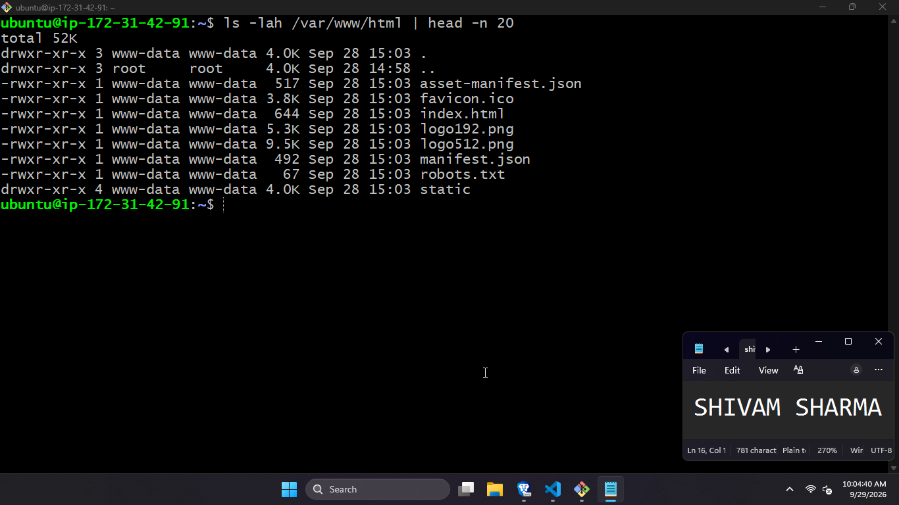

---

#### Screenshot 2 — Output of `grep -R "Deployed by" -n /var/www/html 2>/dev/null | head`

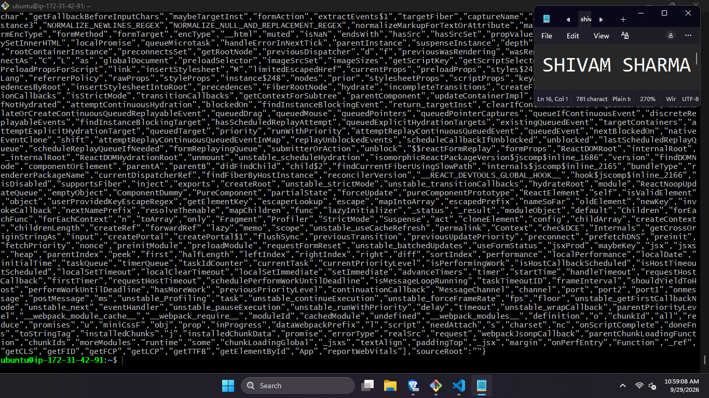

---

#### Screenshot 3 — Output of `grep -n "try_files" /etc/nginx/sites-available/default`

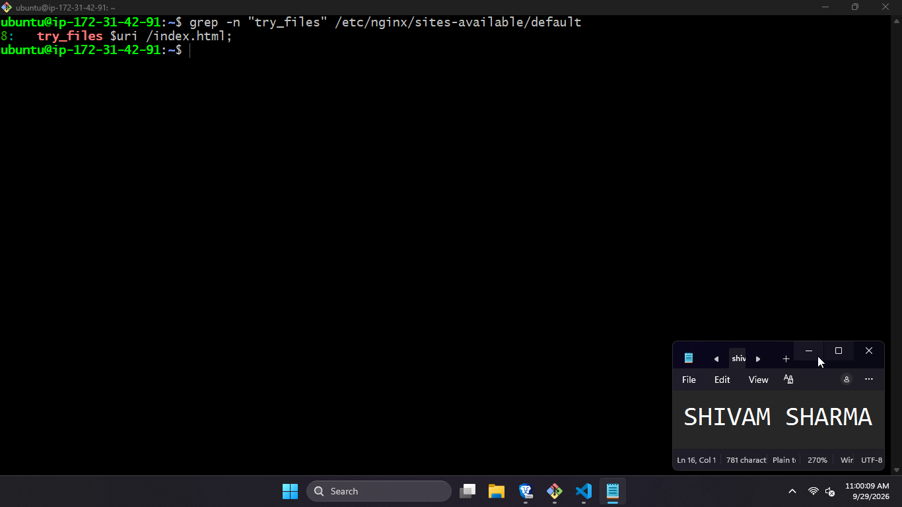

---

### Notes

Answer the following in your own words:

**1. How do you confirm that the correct version of the application is deployed?**

Deployment is confirmed through three independent checks. First, `ls -lah /var/www/html` shows that `index.html` and the `static/` directory are present, confirming that a production React build was copied to the Nginx web root. Second, `grep -R "Deployed by" /var/www/html` finds the string "Deployed by Javeson Francois Liu" inside the bundled JavaScript, confirming that the personalized version of the application was built and deployed — not a generic or stale version. Third, `grep -n "try_files" /etc/nginx/sites-available/default` confirms that Nginx is configured with `try_files $uri /index.html`, which is required for React's client-side routing to work correctly on page refresh. Together, these three checks verify that the right build artifact is in the right location with the right server configuration.

---

# Task 6 — Nginx Configuration Failure Simulation

## Goal

Simulate a real-world Nginx misconfiguration and recover the service safely.

### Evidence

#### Screenshot 1 — Output of `sudo nginx -t` showing the syntax error (broken config)

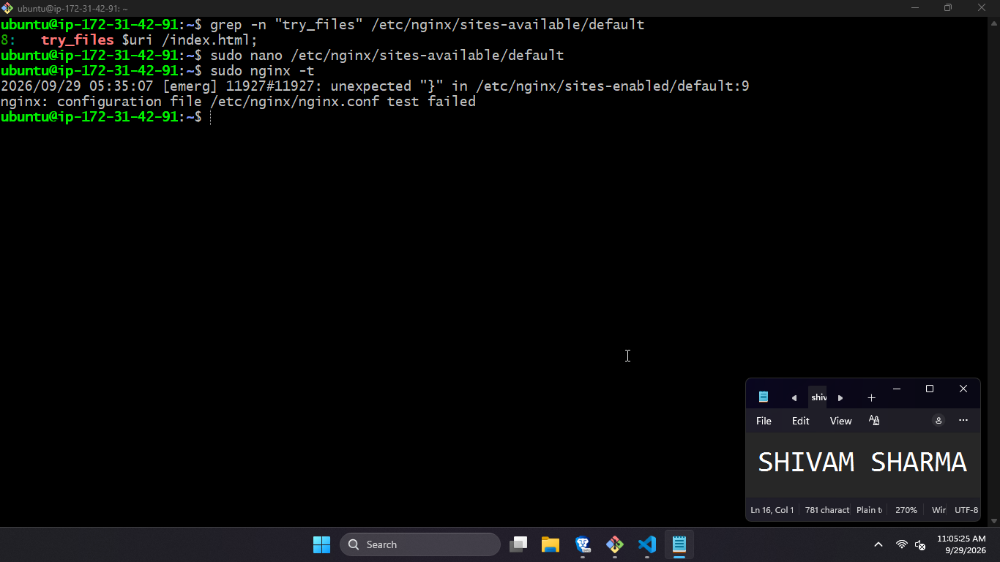

---

#### Screenshot 2 — Output of `sudo nginx -t` showing syntax ok (fixed config)

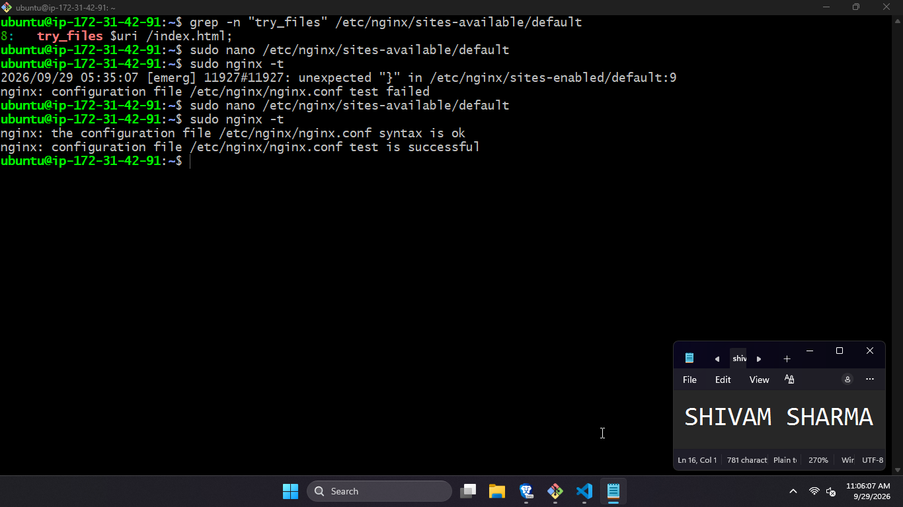

---

#### Screenshot 3 — Output of `curl -I http://<public-ip>` confirming recovery (200 OK)

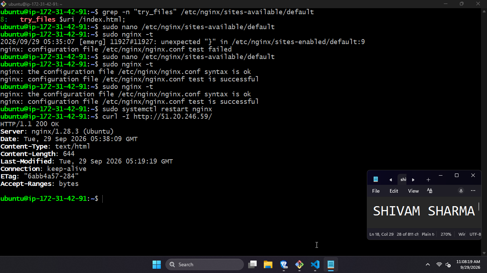

---

### Notes

Answer the following in your own words:

**1. What caused the configuration failure?**

Removing the semicolon `;` from the end of the `try_files $uri /index.html` directive caused the configuration failure. In Nginx configuration syntax, every directive must end with a semicolon. Without it, the Nginx config parser cannot determine where the directive ends, resulting in a syntax error that prevents the configuration from loading.

---

**2. How did you fix the issue?**

The fix was to re-open the Nginx configuration file with `sudo nano /etc/nginx/sites-available/default` and restore the semicolon at the end of `try_files $uri /index.html;`. After saving the file, `sudo nginx -t` was run to validate the syntax, which returned "syntax is ok" and "test is successful". The service was then restarted with `sudo systemctl restart nginx` and verified with `curl -I http://43.216.24.74` returning HTTP 200 OK.

---

**3. How can you avoid this kind of issue in real production systems?**

In real production systems, configuration changes should never be made directly on the live server. The standard approach is to version-control all Nginx configuration files in a Git repository, make changes in a branch, test them in a staging environment, and only apply them to production after validation. Additionally, always run `sudo nginx -t` before applying any configuration change, and use configuration management tools such as Ansible or Terraform to enforce consistent, reviewed configuration across all servers. A deployment pipeline that runs `nginx -t` as a pre-flight check before reloading the service provides an automated safety net.

---

# Task 7 — Web Application Failure Simulation

## Goal

Simulate missing deployment content and recover the application safely.

### Evidence

#### Screenshot 1 — Output of `curl -I http://<public-ip>` showing failure (non-200 response)

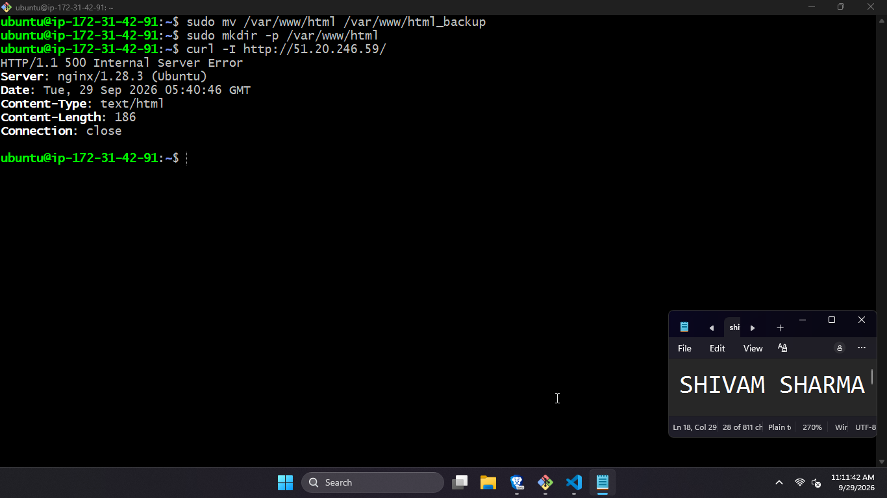

---

#### Screenshot 2 — Output of `curl -I http://<public-ip>` confirming recovery (200 OK)

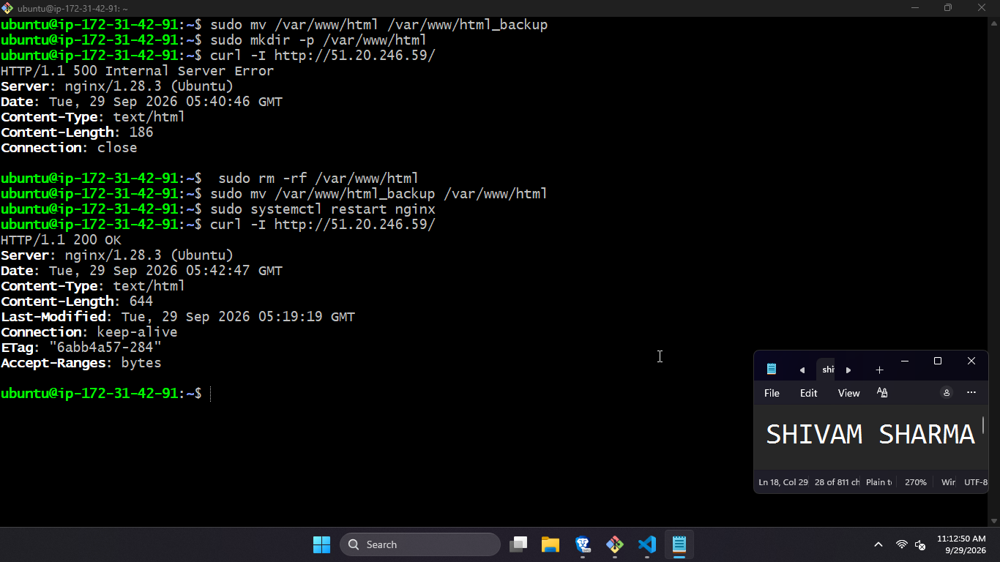

---

### Notes

Answer the following in your own words:

**1. What caused the application to break in this scenario?**

Moving `/var/www/html` to `/var/www/html_backup` and replacing it with an empty directory caused the failure. Nginx found the `root` directory at `/var/www/html` but could not locate `index.html` inside the empty folder. With no files to serve and the `try_files` directive finding nothing to fall back to, Nginx returned `HTTP/1.1 500 Internal Server Error`. The empty directory existing is what causes a 500 rather than 404 — Nginx can read the directory but cannot process the request to completion.

---

**2. How did you fix the issue and restore the application?**

The fix was to remove the empty `/var/www/html` placeholder directory, restore the original deployment from the backup using `sudo mv /var/www/html_backup /var/www/html`, and then restart Nginx with `sudo systemctl restart nginx`. After the restart, `curl -I http://43.216.24.74` returned HTTP 200 OK, confirming the application was serving correctly again.

---

**3. What steps would you take to prevent this kind of issue in real production systems?**

In real production, the web root should never be modified directly on the live server. Deployments should use atomic swaps — building the new version in a separate directory, validating it, and then using a symlink switch (`ln -sfn /var/www/html_v2 /var/www/html`) so the change is instantaneous and the previous version remains as a fallback. Automated deployment pipelines should include health checks that verify the application returns 200 OK before considering a deployment successful. Infrastructure backups and snapshot policies ensure that even in worst-case scenarios, a known-good state can be restored quickly.

---

# Task 8 — Security & Reliability Review

## Goal

Review and reflect on the security and reliability practices applied during this assignment.

### Security & Reliability Notes

Answer the following in your own words:

**1. Why is SSH key-based authentication more secure than sharing passwords?**

SSH key-based authentication uses asymmetric cryptography — a private key that never leaves your machine and a public key stored on the server. Even if an attacker intercepts the network traffic or compromises the server's public key list, they cannot derive the private key. Passwords, by contrast, are vulnerable to brute-force attacks, credential stuffing, phishing, and interception if transmitted over insecure channels. Keys are also longer and mathematically harder to guess than any humanly memorable password. Password-sharing additionally creates audit trail problems — you cannot tell which person used a shared password.

---

**2. Why should only required ports be open on a production server?**

Every open port is an exposed attack surface. A service listening on an unnecessary port can be targeted for exploitation, denial-of-service, or unauthorized access. Minimising open ports reduces the blast radius of any single vulnerability — an attacker who finds a flaw in a running service can only exploit it if the port is reachable. In the security principle of least privilege applied to networking, only traffic that is required for the application to function should be permitted. For this deployment, only ports 22 (SSH) and 80 (HTTP) are needed.

---

**3. Why is it important for Nginx to be enabled on boot?**

If Nginx is not enabled as a systemd service, it will not start automatically when the server reboots. Any reboot — whether planned maintenance, a kernel update, or an unexpected crash — would leave the application inaccessible until someone manually starts Nginx. In production, server reboots are routine, and auto-starting critical services ensures the application recovers automatically without requiring human intervention, reducing mean time to recovery (MTTR) and meeting availability SLAs.

---

**4. What are the risks of sharing secrets, keys, or credentials publicly?**

Publicly shared credentials are immediately actionable by anyone who finds them. Exposed AWS access keys have led to hundreds of thousands of dollars in fraudulent compute charges within hours of being committed to a public GitHub repository. SSH private keys allow full server access. API tokens can be used to exfiltrate data, send spam, or destroy cloud resources. Automated bots continuously scan public code repositories for credential patterns. Once a secret is public, it must be considered fully compromised and rotated immediately — even if it was only exposed for seconds.

---

**5. Why should cloud resources be stopped or terminated when they are no longer needed?**

Cloud resources are billed by usage. An EC2 instance left running accumulates compute charges every hour, even when idle. At scale, forgotten resources — "orphaned" instances, unattached EBS volumes, unused Elastic IPs — represent significant wasted spend. Beyond cost, running instances increase the attack surface: an idle server still receives network traffic and can be exploited if its software becomes outdated. Terminating resources when they are no longer needed reduces cost, shrinks the attack surface, and keeps cloud accounts clean and auditable.

---

# LinkedIn Post (Required)

## Evidence

#### LinkedIn Post URL

Paste your LinkedIn post URL here:

`https://www.linkedin.com/posts/shivamsharma-builds_devops-aws-cloudcomputing-share-7510582091764371457-3qmx`

---

#### Screenshot — Published LinkedIn post

---

# Submission Instructions

- Add all required screenshots in your submission
- Full name must be visible in required screenshots
- Do not expose sensitive information (keys, passwords, account IDs)

---

# Completion Checklist

- [✅] Task 1: Screenshots (browser, ip a, ss -tulpen, ufw status) + Notes answered
- [✅] Task 2: Screenshots (nginx status, nginx -t, ss port 80) + Notes answered
- [✅] Task 3: Screenshots (access log, error log, journalctl) + Notes answered
- [✅] Task 4: Screenshots (uptime, free -h, df -h, du -sh) + Notes answered
- [✅] Task 5: Screenshots (ls html, grep deployed by, grep try_files) + Notes answered
- [✅] Task 6: Screenshots (nginx -t fail, nginx -t pass, curl recovery) + Notes answered
- [✅] Task 7: Screenshots (curl failure, curl recovery) + Notes answered
- [✅] Task 8: Security & Reliability Notes answered
- [✅] LinkedIn post published and URL submitted
- [✅] Full Name visible in all required screenshots
- [✅] No sensitive data exposed

---

## 📌 About DMI & CloudAdvisory

DevOps Micro Internship (DMI) is a project-based DevOps program run by Pravin Mishra (The CloudAdvisory) focused on real-world execution, systems thinking, and career readiness.

It helps learners build strong DevOps foundations with hands-on experience.

---

## 📌 Resources

- 🌐 DMI Official Website: https://dmi.pravinmishra.com?utm_source=github&utm_medium=readme  
- 🎓 University: https://university.pravinmishra.com?utm_source=github&utm_medium=readme  
- 💬 Discord Community: https://discord.pravinmishra.com?utm_source=github&utm_medium=readme  
- 📝 Blog: https://dmi.pravinmishra.com/blog?utm_source=github&utm_medium=readme  
- ▶️ YouTube Playlist: https://www.youtube.com/playlist?list=PLFeSNDtI4Cho  
- 🔗 Pravin Mishra (LinkedIn): https://www.linkedin.com/in/pravin-mishra-aws-trainer/  
- 🏢 CloudAdvisory (LinkedIn): https://www.linkedin.com/company/thecloudadvisory/

---

*This submission is part of DevOps Micro Internship (DMI) — Agentic AI Track.*