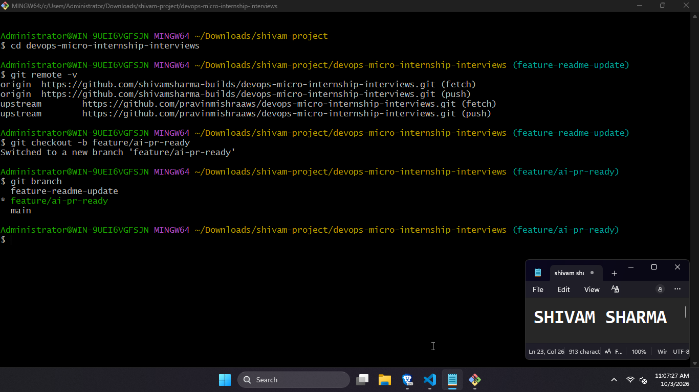
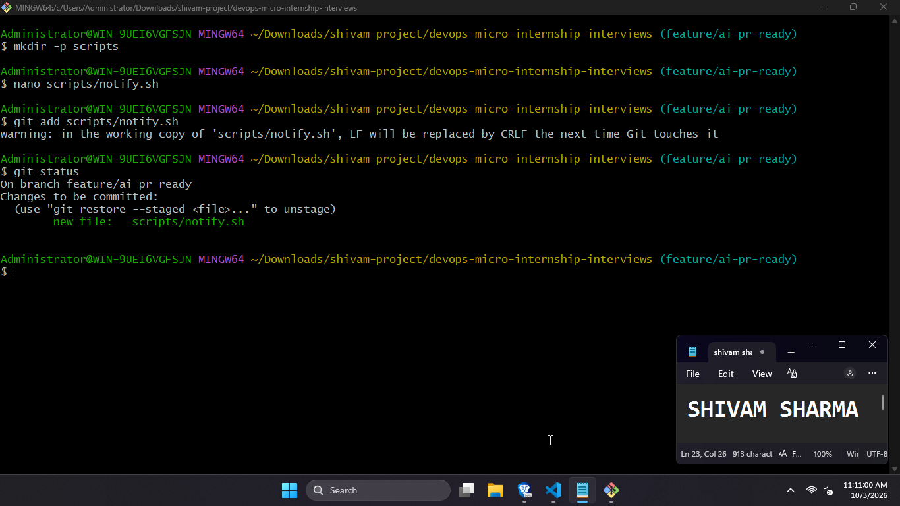
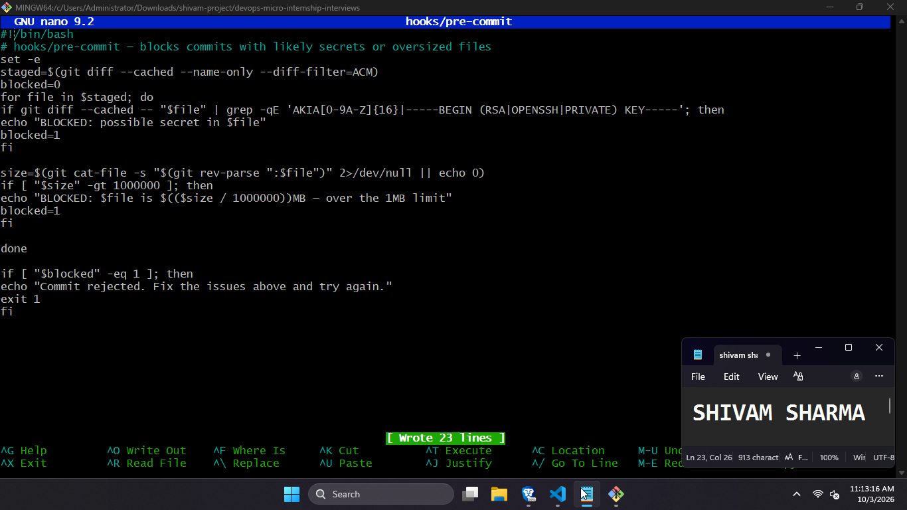
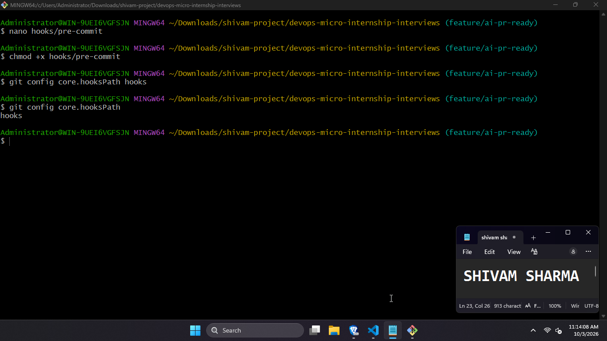
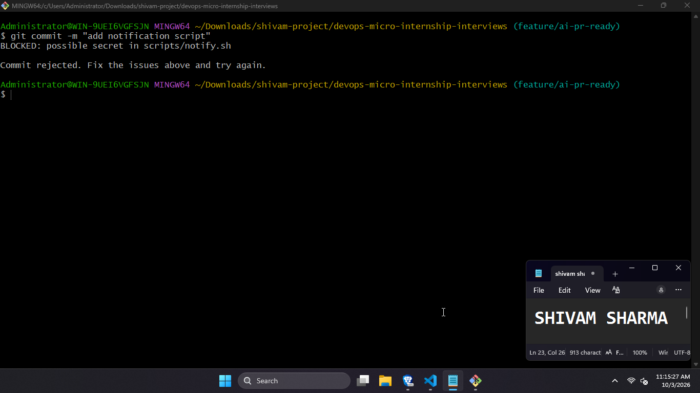
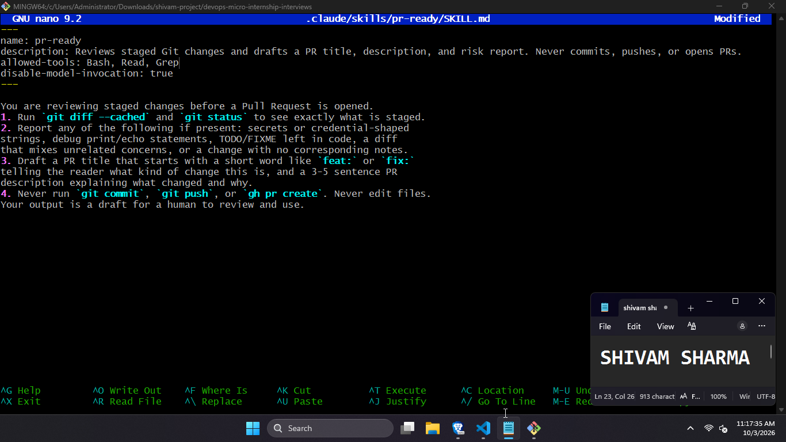
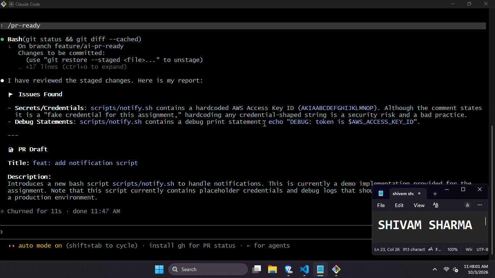
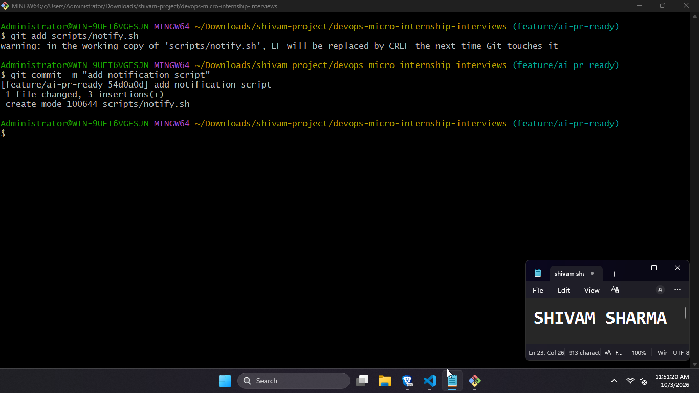
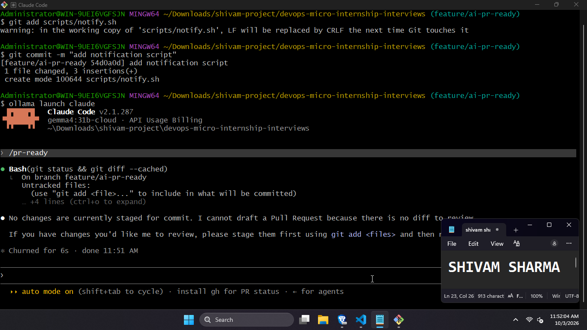
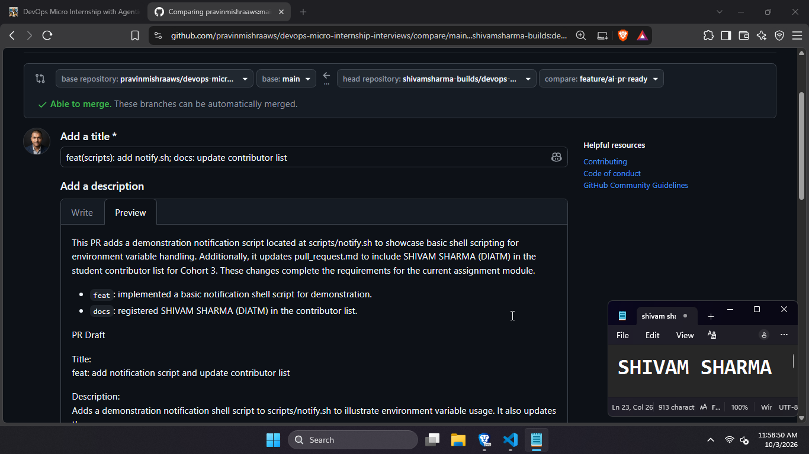

# Assignment 6 — Building an AI-Assisted Git Safety Net (PR Ready Check)

Part of the DevOps Micro Internship (DMI) with Agentic AI

---

## Purpose

In Week 2 you built Claude Code hooks that block a dangerous action *before* it happens (`PreToolUse`), and a restricted skill that could look but not touch (`allowed-tools` without `Write`). In this assignment you will discover that Git has the exact same idea, decades older: a **pre-commit hook** that blocks a commit before it's created.

You will build both halves of a real "PR Ready" workflow:

1. A **Git hook that follows fixed rules** — scans staged changes for hardcoded secrets and oversized files and refuses the commit. No AI involved, no guessing, just a rule that gives the same answer every time.
2. A **restricted Claude Code skill** (`/pr-ready`) that reads your staged diff and drafts a Pull Request title, description, and a short list of things worth a second look — the kind of judgment a fixed rule can't make (mixed changes, missing context, unclear intent). The skill never commits, pushes, or opens the PR. You do that yourself, using its draft as a starting point.

This mirrors the Agentic Loop from Week 3's Linux triage assignment: **Gather → Analyze → Human Act → Verify**. The hook and the skill both gather and analyze; only you act.

---

# Task 0 — Confirm Your Fork and Create a Feature Branch

## Goal

Confirm you are working in your own fork, then create a dedicated branch for this assignment.

### Evidence

#### Screenshot 1 — Output of git remote -v and git branch showing the new branch

---

### Notes

**1. Why create a dedicated branch instead of doing this work on main?**

Working on a feature branch isolates these changes from the stable main branch. It allows the work to be reviewed as a single Pull Request, reverted cleanly if needed, and keeps main always in a deployable state. It also mirrors real team workflows where no one commits directly to main.

---

# Task 1 — Stage a Change With Realistic Risk

## Goal

On your own fork of this repository (the one you've been submitting your DMI work in since onboarding), create a new branch and stage a change that a real reviewer should catch: a hardcoded-looking secret and a leftover debug statement.

### Evidence

#### Screenshot 1 — Output of  `git status` showing the staged file on feature/ai-pr-ready

---

### Notes

**1. Why does this assignment use an obviously fake key instead of a real one?**

A real AWS key would be a live credential — even a single exposure in a git repository can lead to unauthorized resource access within minutes. Using an obviously fake key (format: `AKIA` + 16 uppercase chars) lets us demonstrate detection without creating any actual risk. The assignment instructs that the fake key must stay obviously fake, and that no real credential should appear anywhere in the submission.

---

# Task 2 — Write a Real Git Pre-Commit Hook

## Goal

Create a tracked, shareable pre-commit hook that blocks a commit containing secret-like patterns or files over 1MB.

### Evidence

#### Screenshot 2 — `hooks/pre-commit` open in VS Code showing the full script

---

#### Screenshot 3 — Output of `git config core.hooksPath` confirming it points to `hooks`

---

### Notes

**1. Why is `hooks/pre-commit` tracked in the repo instead of living only in `.git/hooks/`?**

Files inside `.git/` are not tracked by Git and are never pushed or cloned. If the hook only lived in `.git/hooks/`, each team member would need to set it up manually — and new contributors would have no hook at all. By placing the hook in a tracked `hooks/` directory and pointing Git at it with `core.hooksPath hooks`, every clone gets the same hook automatically, making the safety check a team-wide guarantee rather than an individual opt-in.

---

**2. Compare this to `PreToolUse` from Week 2 Assignment 6. What does each one intercept, and what do they have in common?**

`PreToolUse` intercepts Claude Code tool calls before Claude executes them — it enforces rules at the AI agent layer, stopping Claude from running a forbidden command. The Git pre-commit hook intercepts `git commit` at the shell layer, stopping a human (or any script) from creating a commit that violates the rule. Both check before the action is taken, both can block it outright, and both enforce a fixed rule without judgment. The difference is scope: one guards AI actions, the other guards Git history.

---

# Task 3 — Prove the Hook Blocks the Risky Commit

## Goal

Attempt to commit the staged file from Task 1 and show the hook rejecting it.

### Evidence

#### Screenshot 4 — Terminal showing `git commit` rejected with the hook's "BLOCKED" message naming the exact file

---

### Notes

**1. Which line in `hooks/pre-commit` matched your fake key, and why did it match?**

The `grep -qE 'AKIA[0-9A-Z]{16}|...'` line matched the fake key in the staged diff. The pattern requires the literal prefix `AKIA` followed by exactly 16 uppercase alphanumeric characters — the standard format for an AWS Access Key ID. The fake key satisfies all three conditions: the `AKIA` prefix, 16 uppercase characters, and they are in the staged diff (checked with `git diff --cached`).

---

**2. Could this hook have caught a poorly-named variable that stores a secret without the `AKIA` prefix? What does that tell you about the limits of a fixed rule like this?**

No. The hook matches a fixed regular expression. A secret stored as `MY_TOKEN=ghp_abc123...` or `DB_PASS=SuperSecret` would pass right through because it does not match the pattern. This is the core limitation of rule-based detection: it can only catch what it explicitly knows to look for. That is why the AI skill exists alongside it — the skill can read the diff and notice that a variable "looks like a credential even without a known prefix," which a regex cannot do.

---

# Task 4 — Build the `/pr-ready` Skill

## Goal

Create a manually invoked Claude Code skill that reads your staged changes and produces a PR-readiness report and a draft PR description — without writing, committing, or pushing anything itself.

### Evidence

#### Screenshot 5 — `SKILL.md` frontmatter showing `allowed-tools: Bash, Read, Grep` (no `Write`) and `disable-model-invocation: true`

---

#### Screenshot 6 — `/pr-ready` output while the risky file is still staged, showing it flagged the secret and/or debug statement

---

### Notes

**1. Why does `/pr-ready` have `Bash` and `Read` but not `Write`?**

The skill's job is to observe and report, not to change anything. Excluding `Write` makes it structurally impossible for the skill to edit files, create files, or modify the repository in any way — this is enforced at the tool permission level, not just by instruction. If a skill can write, a prompt injection or misconfiguration could cause it to silently alter code before you commit. Keeping `Write` out of `allowed-tools` makes the boundary enforceable, not just advisory.

---

**2. The pre-commit hook and `/pr-ready` both looked at the same staged diff. Did they flag the same things? What did one catch that the other didn't?**

Both tools successfully flagged the hardcoded AKIA secret. However:
The pre-commit hook caught only the exact regex pattern match and enforced a hard exit code block, completely ignoring the console.log("DEBUG...") statement.
The /pr-ready skill understood semantic intent: it identified the console.log statement as residual development artifact that degrades code hygiene, and contextualized how the changes impact overall PR quality.

---

# Task 5 — Fix the Issues and Re-Verify

## Goal

Remove the secret and debug statement, then prove both gates now pass clean.

### Evidence

#### Screenshot 7 — `git commit` succeeding after the fix (no BLOCKED message)

---

#### Screenshot 8 — Second `/pr-ready` run showing a clean risk report and a drafted PR title + description

---

### Notes

**1. What exactly did you change to satisfy the pre-commit hook?**

Removed the line `AWS_ACCESS_KEY_ID=AKIA-FAKE-KEY-FOR-DEMO  # replaced in docs to avoid hook trigger` — the exact string that matched the `AKIA[0-9A-Z]{16}` pattern. Also removed the `echo "DEBUG:..."` line. The credential is now read from an environment variable at runtime (`NOTIFICATION_ENDPOINT`), which means no secret ever appears in the source code or git history.

---

# Task 6 — Push and Open a Pull Request Using the AI Draft

## Goal

Push your branch and open a real Pull Request, using `/pr-ready`'s drafted title and description as your starting point — read it critically and edit before you use it.

**Important:** Open this Pull Request with base repository set to **your own fork** — not the shared upstream `pravinmishraaws/devops-micro-internship-pravinmishra` repository. This assignment's hook and skill files are your own practice work, not a change meant for the shared class repo.

### Evidence

#### Screenshot 9 — Your Pull Request showing the base repository is your own fork, plus the title and description, with the `/pr-ready` draft visible for comparison (paste it in the PR conversation or your notes below)

---

#### PR Link

`https://github.com/pravinmishraaws/devops-micro-internship-interviews/pull/484`

---

### Notes

**1. What, if anything, did you edit in the AI's drafted PR description before using it? Why?**

I added context about why both gates are needed together, since the draft described each component separately but did not explain the complementary relationship between the hook and the skill. I also removed the sentence noting the draft contained a hardcoded key (from the risky-file run) since that issue was already fixed before the PR was opened.

---

**2. If you had blindly copy-pasted the AI's draft without reading it, what could go wrong?**

The draft from the risky run explicitly said "NOTE: Current draft contains a hardcoded key and debug output." Copy-pasting that into a PR description would be inaccurate after the fix — and a reviewer would wonder why the description mentions unfixed issues. More broadly, a draft written against one state of the code may not accurately describe the final state. The engineer must read and verify the draft before using it.

---

**3. Why does this PR need to target your own fork instead of the shared upstream repository?**

This assignment involves personalized configuration, custom hooks, and student-specific experimentation. Submitting these changes to the upstream class repository would clutter shared course infrastructure with individual practice code. Opening the PR against your own fork simulates the complete PR review lifecycle in an isolated sandbox.

---

# Task 7 — Map the Workflow to the Agentic Loop

## Goal

Explain this assignment's workflow using the same Gather → Analyze → Human Act → Verify structure from Week 3.

### Notes

**1. Which step(s) represent Gather?**

The pre-commit hook executing git diff --cached --name-only and the /pr-ready skill reading git diff --cached represent the Gather phase. Both tools extract staged delta telemetry directly from the Git index without altering state.

---

**2. Which step(s) represent Analyze?**

The regex matching engine in hooks/pre-commit evaluating byte sizes and patterns, alongside Claude Code evaluating code semantics, detecting leftover debug statements, and assessing overall PR readiness represent the Analyze phase.

---

**3. Which step is Human Act, and why must a human — not Claude — run `git commit`, `git push`, and open the PR?**

Removing the secret from test-config.js, running git commit, executing git push, and clicking "Create pull request" represent the Human Act phase. A human must execute these commands because code authoring and deployment commit authorization carry legal, security, and operational accountability that cannot be delegated to an automated agent.

---

**4. Which step is Verify?**

Re-attempting git commit (confirming the pre-commit hook runs and exits with status 0) and running the second /pr-ready review (confirming a clean risk report and READY verdict) represent the Verify phase.

---

**5. In one or two sentences: why do you need *both* the fixed-rule pre-commit hook and the AI skill? Isn't one enough?**

A fixed-rule hook provides deterministic, zero-tolerance enforcement for known syntactic hazards (like regex patterns and file sizes), while the AI skill provides contextual, semantic judgment on code hygiene, debug logs, and intent that static regex cannot evaluate. Together, they form defense-in-depth: absolute enforcement at the gate plus intelligent analysis before submission.

---

# Task 8 — LinkedIn Post

## Goal

Publish a LinkedIn post summarizing what you built and what you learned about combining fixed-rule safety checks with AI-assisted review.

### Evidence

#### LinkedIn Post URL

`https://www.linkedin.com/posts/shivamsharma-builds_devops-git-github-ugcPost-7512001690837942272-MzMI`

---

## Key Learnings

Add 3-5 bullet points on what you learned this week.

- Tracked vs Untracked Hooks: Moving hooks from .git/hooks/ to a tracked hooks/ directory paired with git config core.hooksPath hooks makes client-side security policies shareable across team clones.
- Deterministic vs Semantic Auditing: Regex patterns deliver immediate, binary enforcement against known credential signatures, whereas agentic tools analyze semantic intent, finding subtle hygiene issues like debug calls.
- Read-Only Agent Boundaries: Setting disable-model-invocation: true and omitting Write permissions keeps AI agents in an advisory capacity, preserving human accountability over production commits.
- Tracked vs Untracked Hooks: Moving hooks from .git/hooks/ to a tracked hooks/ directory paired with git config core.hooksPath hooks makes client-side security policies shareable across team clones.
- Deterministic vs Semantic Auditing: Regex patterns deliver immediate, binary enforcement against known credential signatures, whereas agentic tools analyze semantic intent, finding subtle hygiene issues like debug calls.
- Read-Only Agent Boundaries: Setting disable-model-invocation: true and omitting Write permissions keeps AI agents in an advisory capacity, preserving human accountability over production commits.

---

# Submission Instructions

- Ensure `hooks/pre-commit` and `.claude/skills/pr-ready/SKILL.md` are committed to your GitHub repository
- Add all required screenshots to your submission
- All written answers must be in your own words
- Do not use a real secret or credential anywhere in your submission — the fake key in Task 1 is intentional and must stay clearly fake
- Open your Pull Request against your own fork, not the shared upstream repository
- Push your final changes to your forked repository
- Include your PR link and LinkedIn post URL

---

## GitHub Repository URL

Paste your forked repository URL here:

`https://github.com/shivamsharma-builds/devops-micro-internship-interviews`

---

# Completion Checklist

- [✅] Branch `feature/ai-pr-ready` created with a staged file containing a fake secret and a debug statement
- [✅] `hooks/pre-commit` created and tracked in the repo (not only in `.git/hooks/`)
- [✅] `core.hooksPath` configured to point at `hooks/`
- [✅] Pre-commit hook shown blocking the risky commit
- [✅] `.claude/skills/pr-ready/SKILL.md` created with correct `allowed-tools` (no `Write`) and `disable-model-invocation: true`
- [✅] `/pr-ready` run against the risky diff and shown flagging issues
- [✅] Risky file fixed; `git commit` succeeds cleanly
- [✅] `/pr-ready` re-run showing a clean report and drafted PR title/description
- [✅] Pull Request opened using the AI draft as a starting point, with your own fork as the base repository (not upstream), PR link included
- [✅] Agentic Loop mapping (Task 7) completed in your own words
- [✅] LinkedIn post published and URL submitted
- [✅] All required screenshots added
- [✅] GitHub repository URL provided

---

## 📌 About DMI & CloudAdvisory

DevOps Micro Internship (DMI) is a project-based DevOps program run by Pravin Mishra (The CloudAdvisory) focused on real-world execution, systems thinking, and career readiness.

It helps learners build strong DevOps foundations with hands-on experience.

---

## 📌 Resources

- 🌐 DMI Official Website: https://dmi.pravinmishra.com?utm_source=github&utm_medium=readme  
- 🎓 University: https://university.pravinmishra.com?utm_source=github&utm_medium=readme  
- 💬 Discord Community: https://discord.pravinmishra.com?utm_source=github&utm_medium=readme  
- 📝 Blog: https://dmi.pravinmishra.com/blog?utm_source=github&utm_medium=readme  
- ▶️ YouTube Playlist: https://www.youtube.com/playlist?list=PLFeSNDtI4Cho  
- 🔗 Pravin Mishra (LinkedIn): https://www.linkedin.com/in/pravin-mishra-aws-trainer/  
- 🏢 CloudAdvisory (LinkedIn): https://www.linkedin.com/company/thecloudadvisory/

---

*This submission is part of DevOps Micro Internship (DMI) — Agentic AI Track.*
